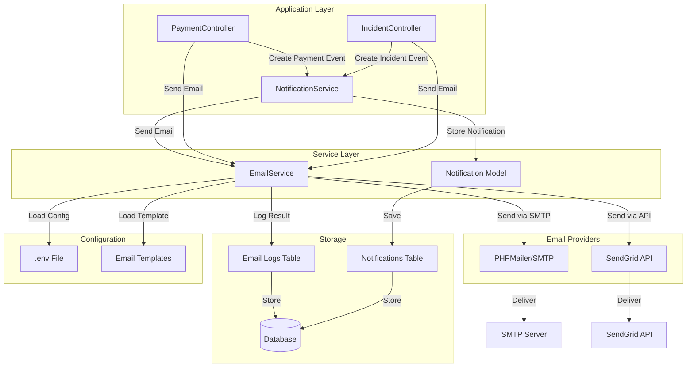
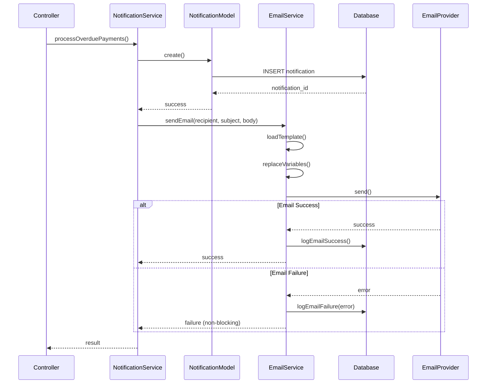

# Design Document - Email Integration

## Overview

This design document specifies the technical implementation for integrating email notification functionality into the ResiTech condominium management system. The system currently stores notifications in the database for payment and incident events. This integration will add email delivery capabilities using PHPMailer (SMTP) or SendGrid (API), with secure credential management through environment variables.

### Goals

- Provide reliable email delivery for payment and incident notifications
- Abstract email provider details behind a unified EmailService interface
- Support multiple email providers (PHPMailer SMTP and SendGrid API)
- Ensure secure credential management using environment variables
- Maintain non-blocking application flow (email failures don't break the app)
- Enable comprehensive logging and error tracking for email operations

### Non-Goals

- Real-time email delivery (emails are sent synchronously but with error handling)
- Email queue management system (future enhancement)
- Email template visual editor (templates are static HTML files)
- Unsubscribe management system (footer text only)
- Email bounce handling and tracking

## Architecture

### System Architecture Diagram



### Component Integration Flow



## Components and Interfaces

### EmailService Class

The EmailService class provides a unified interface for sending emails regardless of the underlying provider.

```php
<?php
/**
 * Email Service
 * 
 * Provides email sending functionality with support for multiple providers
 * (PHPMailer SMTP and SendGrid API). Handles template loading, variable
 * replacement, error handling, and logging.
 * 
 * @package App\Services
 */
class EmailService {
    private $db;
    private $driver;
    private $mailer;
    private $config;
    private $enabled;
    
    /**
     * Constructor
     * 
     * @param PDO $db Database connection
     */
    public function __construct($db) {
        $this->db = $db;
        $this->loadConfiguration();
        $this->initializeMailer();
    }
    
    /**
     * Load email configuration from environment variables
     * 
     * @return void
     */
    private function loadConfiguration() {
        $this->config = [
            'driver' => getenv('MAIL_DRIVER') ?: 'smtp',
            'host' => getenv('MAIL_HOST'),
            'port' => getenv('MAIL_PORT') ?: 587,
            'username' => getenv('MAIL_USERNAME'),
            'password' => getenv('MAIL_PASSWORD'),
            'from_address' => getenv('MAIL_FROM_ADDRESS'),
            'from_name' => getenv('MAIL_FROM_NAME') ?: 'ResiTech',
            'sendgrid_api_key' => getenv('SENDGRID_API_KEY'),
            'test_mode' => getenv('MAIL_TEST_MODE') === 'true'
        ];
        
        // Validate required configuration
        $this->enabled = $this->validateConfiguration();
    }
    
    /**
     * Validate email configuration
     * 
     * @return bool True if configuration is valid
     */
    private function validateConfiguration() {
        if ($this->config['test_mode']) {
            error_log("[EmailService] Running in TEST MODE - emails will be logged, not sent");
            return true;
        }
        
        if ($this->config['driver'] === 'smtp') {
            if (empty($this->config['host']) || empty($this->config['username']) || empty($this->config['password'])) {
                error_log("[EmailService] SMTP configuration incomplete - email sending disabled");
                return false;
            }
        } elseif ($this->config['driver'] === 'sendgrid') {
            if (empty($this->config['sendgrid_api_key'])) {
                error_log("[EmailService] SendGrid API key missing - email sending disabled");
                return false;
            }
        }
        
        if (empty($this->config['from_address'])) {
            error_log("[EmailService] FROM address missing - email sending disabled");
            return false;
        }
        
        return true;
    }
    
    /**
     * Initialize email provider (PHPMailer or SendGrid)
     * 
     * @return void
     */
    private function initializeMailer() {
        if (!$this->enabled || $this->config['test_mode']) {
            return;
        }
        
        try {
            if ($this->config['driver'] === 'smtp') {
                $this->initializePHPMailer();
            } elseif ($this->config['driver'] === 'sendgrid') {
                $this->initializeSendGrid();
            }
        } catch (Exception $e) {
            error_log("[EmailService] Failed to initialize mailer: " . $e->getMessage());
            $this->enabled = false;
        }
    }
    
    /**
     * Initialize PHPMailer for SMTP
     * 
     * @return void
     * @throws Exception
     */
    private function initializePHPMailer() {
        require_once __DIR__ . '/../../vendor/autoload.php';
        
        $this->mailer = new PHPMailer\PHPMailer\PHPMailer(true);
        $this->mailer->isSMTP();
        $this->mailer->Host = $this->config['host'];
        $this->mailer->SMTPAuth = true;
        $this->mailer->Username = $this->config['username'];
        $this->mailer->Password = $this->config['password'];
        $this->mailer->SMTPSecure = PHPMailer\PHPMailer\PHPMailer::ENCRYPTION_STARTTLS;
        $this->mailer->Port = $this->config['port'];
        $this->mailer->CharSet = 'UTF-8';
        
        // Test connection
        if (!$this->mailer->smtpConnect()) {
            throw new Exception("SMTP connection failed");
        }
        $this->mailer->smtpClose();
        
        error_log("[EmailService] PHPMailer initialized successfully");
    }
    
    /**
     * Initialize SendGrid API client
     * 
     * @return void
     * @throws Exception
     */
    private function initializeSendGrid() {
        require_once __DIR__ . '/../../vendor/autoload.php';
        
        $this->mailer = new \SendGrid($this->config['sendgrid_api_key']);
        error_log("[EmailService] SendGrid initialized successfully");
    }
    
    /**
     * Send HTML email
     * 
     * @param string|array $to Recipient email address(es)
     * @param string $subject Email subject
     * @param string $body HTML email body
     * @param array $options Optional parameters (cc, bcc, attachments)
     * @return array Result with success status and message
     */
    public function sendHtmlEmail($to, $subject, $body, $options = []) {
        return $this->send($to, $subject, $body, true, $options);
    }
    
    /**
     * Send plain text email
     * 
     * @param string|array $to Recipient email address(es)
     * @param string $subject Email subject
     * @param string $body Plain text email body
     * @param array $options Optional parameters (cc, bcc, attachments)
     * @return array Result with success status and message
     */
    public function sendTextEmail($to, $subject, $body, $options = []) {
        return $this->send($to, $subject, $body, false, $options);
    }
    
    /**
     * Send email using configured provider
     * 
     * @param string|array $to Recipient email address(es)
     * @param string $subject Email subject
     * @param string $body Email body
     * @param bool $isHtml Whether body is HTML
     * @param array $options Optional parameters
     * @return array Result with success status and message
     */
    private function send($to, $subject, $body, $isHtml = true, $options = []) {
        $start_time = microtime(true);
        
        // Handle test mode
        if ($this->config['test_mode']) {
            return $this->logTestEmail($to, $subject, $body);
        }
        
        // Check if email service is enabled
        if (!$this->enabled) {
            $error = "Email service is disabled due to configuration errors";
            $this->logEmail($to, $subject, 'failure', $error);
            return ['success' => false, 'error' => $error];
        }
        
        try {
            // Retry logic
            $max_retries = 3;
            $retry_count = 0;
            $last_error = null;
            
            while ($retry_count < $max_retries) {
                try {
                    if ($this->config['driver'] === 'smtp') {
                        $result = $this->sendViaPHPMailer($to, $subject, $body, $isHtml, $options);
                    } else {
                        $result = $this->sendViaSendGrid($to, $subject, $body, $isHtml, $options);
                    }
                    
                    $duration = round((microtime(true) - $start_time) * 1000, 2);
                    error_log("[EmailService] Email sent successfully in {$duration}ms to: " . (is_array($to) ? implode(', ', $to) : $to));
                    
                    $this->logEmail($to, $subject, 'success', null, $duration);
                    return ['success' => true, 'message' => 'Email sent successfully'];
                    
                } catch (Exception $e) {
                    $last_error = $e->getMessage();
                    $retry_count++;
                    
                    if ($retry_count < $max_retries) {
                        // Exponential backoff: 1s, 2s, 4s
                        $wait_time = pow(2, $retry_count - 1);
                        error_log("[EmailService] Retry $retry_count/$max_retries after {$wait_time}s: " . $last_error);
                        sleep($wait_time);
                    }
                }
            }
            
            // All retries failed
            error_log("[EmailService] Email sending failed after $max_retries attempts: " . $last_error);
            $this->logEmail($to, $subject, 'failure', $last_error);
            return ['success' => false, 'error' => $last_error];
            
        } catch (Exception $e) {
            $error = $e->getMessage();
            error_log("[EmailService] Unexpected error: " . $error);
            $this->logEmail($to, $subject, 'failure', $error);
            return ['success' => false, 'error' => $error];
        }
    }
    
    /**
     * Send email via PHPMailer
     * 
     * @param string|array $to Recipient(s)
     * @param string $subject Subject
     * @param string $body Body
     * @param bool $isHtml Is HTML
     * @param array $options Options
     * @return bool Success
     * @throws Exception
     */
    private function sendViaPHPMailer($to, $subject, $body, $isHtml, $options) {
        $this->mailer->clearAddresses();
        $this->mailer->clearCCs();
        $this->mailer->clearBCCs();
        $this->mailer->clearAttachments();
        
        $this->mailer->setFrom($this->config['from_address'], $this->config['from_name']);
        
        // Add recipients
        if (is_array($to)) {
            foreach ($to as $email) {
                $this->mailer->addAddress($email);
            }
        } else {
            $this->mailer->addAddress($to);
        }
        
        // Add CC recipients
        if (isset($options['cc'])) {
            $cc_list = is_array($options['cc']) ? $options['cc'] : [$options['cc']];
            foreach ($cc_list as $cc) {
                $this->mailer->addCC($cc);
            }
        }
        
        // Add BCC recipients
        if (isset($options['bcc'])) {
            $bcc_list = is_array($options['bcc']) ? $options['bcc'] : [$options['bcc']];
            foreach ($bcc_list as $bcc) {
                $this->mailer->addBCC($bcc);
            }
        }
        
        $this->mailer->isHTML($isHtml);
        $this->mailer->Subject = $subject;
        $this->mailer->Body = $body;
        
        if ($isHtml) {
            $this->mailer->AltBody = strip_tags($body);
        }
        
        return $this->mailer->send();
    }
    
    /**
     * Send email via SendGrid
     * 
     * @param string|array $to Recipient(s)
     * @param string $subject Subject
     * @param string $body Body
     * @param bool $isHtml Is HTML
     * @param array $options Options
     * @return bool Success
     * @throws Exception
     */
    private function sendViaSendGrid($to, $subject, $body, $isHtml, $options) {
        $from = new \SendGrid\Mail\From($this->config['from_address'], $this->config['from_name']);
        
        // Handle multiple recipients
        $to_list = is_array($to) ? $to : [$to];
        $tos = [];
        foreach ($to_list as $email) {
            $tos[] = new \SendGrid\Mail\To($email);
        }
        
        $content_type = $isHtml ? 'text/html' : 'text/plain';
        $content = new \SendGrid\Mail\Content($content_type, $body);
        
        $mail = new \SendGrid\Mail\Mail($from, $tos[0], $subject, $content);
        
        // Add additional recipients
        for ($i = 1; $i < count($tos); $i++) {
            $mail->addTo($tos[$i]);
        }
        
        $response = $this->mailer->send($mail);
        
        if ($response->statusCode() >= 200 && $response->statusCode() < 300) {
            return true;
        } else {
            throw new Exception("SendGrid API error: " . $response->statusCode());
        }
    }
    
    /**
     * Load email template and replace variables
     * 
     * @param string $template_name Template file name (without .php extension)
     * @param array $variables Variables to replace in template
     * @return string Rendered HTML
     */
    public function loadTemplate($template_name, $variables = []) {
        $template_path = __DIR__ . '/../views/emails/' . $template_name . '.php';
        
        if (!file_exists($template_path)) {
            error_log("[EmailService] Template not found: $template_path");
            return $this->getDefaultTemplate($variables);
        }
        
        // Extract variables for use in template
        extract($variables);
        
        // Capture template output
        ob_start();
        include $template_path;
        $html = ob_get_clean();
        
        return $html;
    }
    
    /**
     * Get default email template
     * 
     * @param array $variables Variables
     * @return string HTML
     */
    private function getDefaultTemplate($variables) {
        $content = isset($variables['content']) ? $variables['content'] : '';
        return "<html><body><p>$content</p></body></html>";
    }
    
    /**
     * Log email sending attempt to database
     * 
     * @param string|array $to Recipient(s)
     * @param string $subject Subject
     * @param string $status Status (success/failure)
     * @param string|null $error Error message
     * @param float|null $duration Duration in milliseconds
     * @return void
     */
    private function logEmail($to, $subject, $status, $error = null, $duration = null) {
        try {
            $recipient = is_array($to) ? implode(', ', $to) : $to;
            
            $query = "INSERT INTO email_logs (recipient, subject, status, error_message, duration_ms, created_at) 
                      VALUES (:recipient, :subject, :status, :error_message, :duration_ms, NOW())";
            
            $stmt = $this->db->prepare($query);
            $stmt->bindParam(':recipient', $recipient);
            $stmt->bindParam(':subject', $subject);
            $stmt->bindParam(':status', $status);
            $stmt->bindParam(':error_message', $error);
            $stmt->bindParam(':duration_ms', $duration);
            $stmt->execute();
            
        } catch (PDOException $e) {
            error_log("[EmailService] Failed to log email: " . $e->getMessage());
        }
    }
    
    /**
     * Log test mode email to file
     * 
     * @param string|array $to Recipient(s)
     * @param string $subject Subject
     * @param string $body Body
     * @return array Result
     */
    private function logTestEmail($to, $subject, $body) {
        $log_dir = __DIR__ . '/../../logs/emails';
        if (!is_dir($log_dir)) {
            mkdir($log_dir, 0755, true);
        }
        
        $log_file = $log_dir . '/email_' . date('Y-m-d') . '.log';
        $recipient = is_array($to) ? implode(', ', $to) : $to;
        
        $log_entry = sprintf(
            "[%s] TO: %s | SUBJECT: %s\n%s\n%s\n\n",
            date('Y-m-d H:i:s'),
            $recipient,
            $subject,
            str_repeat('-', 80),
            $body
        );
        
        file_put_contents($log_file, $log_entry, FILE_APPEND);
        error_log("[EmailService] Test email logged to: $log_file");
        
        return ['success' => true, 'message' => 'Test email logged'];
    }
    
    /**
     * Check if email service is enabled
     * 
     * @return bool
     */
    public function isEnabled() {
        return $this->enabled || $this->config['test_mode'];
    }
}
?>
```


### NotificationService Integration

The existing NotificationService will be enhanced to send emails after creating database notifications.

```php
<?php
/**
 * Enhanced NotificationService with Email Integration
 * 
 * Extends existing notification functionality to include email delivery
 */
class NotificationService {
    private $db;
    private $payment;
    private $resident;
    private $notification;
    private $emailService; // NEW
    
    public function __construct($db) {
        $this->db = $db;
        $this->payment = new Payment($db);
        $this->resident = new Resident($db);
        $this->notification = new Notification($db);
        $this->emailService = new EmailService($db); // NEW
    }
    
    /**
     * Generate notification and send email
     * 
     * @param array $payment_data Payment data
     * @param array $resident_data Resident data
     * @return bool Success
     */
    private function generateNotification($payment_data, $resident_data) {
        try {
            // Existing database notification logic
            $titulo = $this->buildNotificationTitle($payment_data['concepto']);
            $mensaje = $this->buildNotificationMessage($payment_data);
            
            if ($this->checkDuplicate($resident_data['usuario_id'], $titulo)) {
                return false;
            }
            
            $this->notification->usuario_id = $resident_data['usuario_id'];
            $this->notification->titulo = $titulo;
            $this->notification->mensaje = $mensaje;
            $this->notification->tipo = 'warning';
            $this->notification->leida = false;
            
            if (!$this->notification->create()) {
                return false;
            }
            
            // NEW: Send email notification
            $this->sendPaymentEmail($payment_data, $resident_data, 'overdue');
            
            return true;
            
        } catch (Exception $e) {
            error_log("[NotificationService] Error: " . $e->getMessage());
            return false;
        }
    }
    
    /**
     * Send payment email notification
     * 
     * @param array $payment_data Payment data
     * @param array $resident_data Resident data
     * @param string $type Email type (overdue, confirmation, reminder)
     * @return void
     */
    private function sendPaymentEmail($payment_data, $resident_data, $type) {
        if (!$this->emailService->isEnabled()) {
            error_log("[NotificationService] Email service disabled, skipping email");
            return;
        }
        
        try {
            $recipient = $resident_data['email'];
            
            if (empty($recipient)) {
                error_log("[NotificationService] No email address for resident ID: " . $resident_data['id']);
                return;
            }
            
            // Prepare template variables
            $variables = [
                'resident_name' => $resident_data['nombre'],
                'apartment' => $resident_data['apartamento'],
                'tower' => $resident_data['torre'],
                'payment_concept' => $payment_data['concepto'],
                'payment_amount' => number_format($payment_data['monto'], 2),
                'payment_month' => $payment_data['mes_pago'],
                'due_date' => date('d/m/Y', strtotime($payment_data['fecha_pago'])),
                'reference' => $payment_data['referencia'] ?? 'N/A',
                'type' => $type
            ];
            
            // Load and render template
            $html_body = $this->emailService->loadTemplate('payment_notification', $variables);
            
            // Determine subject based on type
            $subjects = [
                'overdue' => 'Pago Vencido - ' . $payment_data['concepto'],
                'confirmation' => 'Confirmación de Pago - ' . $payment_data['concepto'],
                'reminder' => 'Recordatorio de Pago - ' . $payment_data['concepto']
            ];
            
            $subject = $subjects[$type] ?? 'Notificación de Pago';
            
            // Send email (non-blocking - errors are logged but don't stop execution)
            $result = $this->emailService->sendHtmlEmail($recipient, $subject, $html_body);
            
            if ($result['success']) {
                error_log("[NotificationService] Email sent to: $recipient");
            } else {
                error_log("[NotificationService] Email failed: " . $result['error']);
            }
            
        } catch (Exception $e) {
            error_log("[NotificationService] Email exception: " . $e->getMessage());
            // Don't throw - email failures should not break notification creation
        }
    }
}
?>
```

### Controller Integration

Controllers will be updated to send emails for specific events.

```php
<?php
/**
 * PaymentController with Email Integration
 */
class PaymentController extends Controller {
    private $payment;
    private $resident;
    private $emailService; // NEW
    
    public function __construct() {
        parent::__construct();
        $this->payment = new Payment($this->db);
        $this->resident = new Resident($this->db);
        $this->emailService = new EmailService($this->db); // NEW
    }
    
    /**
     * Store payment and send confirmation email
     */
    private function storePayment() {
        // ... existing validation and payment creation logic ...
        
        if($this->payment->create()) {
            // NEW: Send payment confirmation email
            $this->sendPaymentConfirmationEmail($data['residente_id'], $this->payment->id);
            
            flash('Pago registrado correctamente', 'success');
            redirect('/payments');
        }
    }
    
    /**
     * Send payment confirmation email
     * 
     * @param int $residente_id Resident ID
     * @param int $payment_id Payment ID
     * @return void
     */
    private function sendPaymentConfirmationEmail($residente_id, $payment_id) {
        if (!$this->emailService->isEnabled()) {
            return;
        }
        
        try {
            // Get resident data
            $this->resident->id = $residente_id;
            $resident_data = $this->resident->readOne();
            
            if (!$resident_data || empty($resident_data['email'])) {
                return;
            }
            
            // Get payment data
            $this->payment->id = $payment_id;
            $payment_data = $this->payment->readOne();
            
            // Prepare variables
            $variables = [
                'resident_name' => $resident_data['nombre'],
                'apartment' => $resident_data['apartamento'],
                'tower' => $resident_data['torre'],
                'payment_concept' => $payment_data['concepto'],
                'payment_amount' => number_format($payment_data['monto'], 2),
                'payment_month' => $payment_data['mes_pago'],
                'payment_date' => date('d/m/Y', strtotime($payment_data['fecha_pago'])),
                'payment_method' => $this->translatePaymentMethod($payment_data['metodo_pago']),
                'reference' => $payment_data['referencia'] ?? 'N/A',
                'type' => 'confirmation'
            ];
            
            $html_body = $this->emailService->loadTemplate('payment_notification', $variables);
            $subject = 'Confirmación de Pago - ' . $payment_data['concepto'];
            
            $this->emailService->sendHtmlEmail($resident_data['email'], $subject, $html_body);
            
        } catch (Exception $e) {
            error_log("[PaymentController] Email error: " . $e->getMessage());
        }
    }
    
    /**
     * Translate payment method to Spanish
     */
    private function translatePaymentMethod($method) {
        $translations = [
            'efectivo' => 'Efectivo',
            'transferencia' => 'Transferencia',
            'tarjeta' => 'Tarjeta',
            'deposito' => 'Depósito'
        ];
        return $translations[$method] ?? $method;
    }
}
?>
```

## Data Models

### Email Logs Table Schema

```sql
CREATE TABLE email_logs (
    id INT AUTO_INCREMENT PRIMARY KEY,
    recipient VARCHAR(255) NOT NULL,
    subject VARCHAR(255) NOT NULL,
    status ENUM('success', 'failure') NOT NULL,
    error_message TEXT NULL,
    duration_ms DECIMAL(10, 2) NULL,
    created_at TIMESTAMP DEFAULT CURRENT_TIMESTAMP,
    INDEX idx_status (status),
    INDEX idx_created_at (created_at),
    INDEX idx_recipient (recipient)
) ENGINE=InnoDB DEFAULT CHARSET=utf8mb4 COLLATE=utf8mb4_unicode_ci;
```

### Environment Variables Schema

The `.env` file structure for email configuration:

```env
# Email Configuration
MAIL_DRIVER=smtp                    # smtp or sendgrid
MAIL_HOST=smtp.gmail.com            # SMTP server host
MAIL_PORT=587                       # SMTP port (587 for TLS, 465 for SSL)
MAIL_USERNAME=your-email@gmail.com  # SMTP username
MAIL_PASSWORD=your-app-password     # SMTP password or app password
MAIL_FROM_ADDRESS=noreply@resitech.com
MAIL_FROM_NAME=ResiTech

# SendGrid Configuration (if using SendGrid)
SENDGRID_API_KEY=your-sendgrid-api-key

# Test Mode (logs emails instead of sending)
MAIL_TEST_MODE=false
```

### Email Template Variables

Standard variables available in all email templates:

```php
[
    'resident_name' => string,      // Resident's full name
    'apartment' => string,          // Apartment number
    'tower' => string,              // Tower/building identifier
    'piso' => string,               // Floor number
    'email' => string,              // Resident's email
    'app_name' => 'ResiTech',       // Application name
    'app_url' => string,            // Application URL
    'current_year' => int           // Current year for footer
]
```

Payment-specific variables:

```php
[
    'payment_concept' => string,    // Payment concept/description
    'payment_amount' => string,     // Formatted amount (e.g., "1,500.00")
    'payment_month' => string,      // Payment month (YYYY-MM)
    'due_date' => string,           // Due date (formatted)
    'payment_date' => string,       // Payment date (formatted)
    'payment_method' => string,     // Payment method (translated)
    'reference' => string,          // Payment reference number
    'type' => string                // Email type (overdue, confirmation, reminder)
]
```

Incident-specific variables:

```php
[
    'incident_title' => string,     // Incident title
    'incident_description' => string, // Incident description
    'incident_category' => string,  // Category (translated)
    'incident_priority' => string,  // Priority (translated)
    'incident_status' => string,    // Current status (translated)
    'incident_id' => int,           // Incident ID
    'incident_url' => string,       // URL to view incident
    'admin_notes' => string,        // Administrator notes
    'created_date' => string,       // Creation date
    'updated_date' => string,       // Last update date
    'type' => string                // Email type (created, status_changed, resolved)
]
```

## Error Handling

### Error Handling Strategy

1. **Configuration Errors**: If email configuration is invalid, disable email service and log error
2. **Connection Errors**: Retry with exponential backoff (3 attempts: 1s, 2s, 4s delays)
3. **Sending Errors**: Log error details but don't block application flow
4. **Template Errors**: Fall back to default template if custom template not found
5. **Database Errors**: Log email attempt failure but continue execution

### Error Logging Levels

```php
// Critical: Email service initialization failed
error_log("[EmailService] CRITICAL: Failed to initialize - " . $error);

// Error: Email sending failed after retries
error_log("[EmailService] ERROR: Email failed after 3 attempts - " . $error);

// Warning: Configuration issue
error_log("[EmailService] WARNING: Missing configuration - email disabled");

// Info: Successful operations
error_log("[EmailService] INFO: Email sent successfully to: " . $recipient);

// Debug: Test mode operations
error_log("[EmailService] DEBUG: Test mode - email logged to file");
```

### Exception Handling Pattern

```php
try {
    // Attempt email operation
    $result = $this->emailService->sendHtmlEmail($to, $subject, $body);
    
    if (!$result['success']) {
        // Log failure but continue
        error_log("[Controller] Email failed: " . $result['error']);
    }
    
} catch (Exception $e) {
    // Catch any unexpected exceptions
    error_log("[Controller] Email exception: " . $e->getMessage());
    // Don't re-throw - email failures should not break the application
}
```

## Testing Strategy

### Unit Testing Approach

Since this is a PHP application without a formal testing framework currently in place, testing will be manual and integration-focused:

1. **Configuration Testing**
   - Test with valid SMTP credentials
   - Test with invalid credentials (should disable gracefully)
   - Test with missing .env file
   - Test with SendGrid API key
   - Test in test mode (should log to file)

2. **Email Sending Testing**
   - Test single recipient
   - Test multiple recipients
   - Test CC and BCC
   - Test HTML and plain text emails
   - Test with template variables
   - Test with missing templates (should use default)

3. **Integration Testing**
   - Test payment overdue notification flow
   - Test payment confirmation flow
   - Test incident creation notification flow
   - Test incident status change notification flow
   - Test administrator notifications

4. **Error Handling Testing**
   - Test with invalid SMTP credentials (should retry and fail gracefully)
   - Test with network timeout
   - Test with invalid recipient email
   - Test with missing resident email (should skip email)
   - Test database logging on success and failure

5. **Template Testing**
   - Test all email templates render correctly
   - Test variable replacement
   - Test responsive design on mobile devices
   - Test email client compatibility (Gmail, Outlook, Apple Mail)

### Test Scenarios

**Scenario 1: Overdue Payment Email**
```
Given: A payment with due date in the past
When: NotificationService.processOverduePayments() is called
Then: 
  - Database notification is created
  - Email is sent to resident
  - Email log entry is created with status 'success'
  - Email contains correct payment details
```

**Scenario 2: Email Service Disabled**
```
Given: MAIL_USERNAME is not set in .env
When: EmailService is initialized
Then:
  - Email service is disabled
  - Error is logged
  - Application continues normally
  - Database notifications still work
```

**Scenario 3: SMTP Connection Failure**
```
Given: SMTP server is unreachable
When: Email is sent
Then:
  - 3 retry attempts are made with exponential backoff
  - After 3 failures, error is logged
  - Email log entry is created with status 'failure'
  - Application continues normally
```

**Scenario 4: Test Mode**
```
Given: MAIL_TEST_MODE=true in .env
When: Email is sent
Then:
  - Email is not actually sent
  - Email content is logged to logs/emails/email_YYYY-MM-DD.log
  - Success response is returned
```

### Manual Testing Checklist

- [ ] Install PHPMailer via Composer
- [ ] Create .env file with SMTP credentials
- [ ] Test email sending with valid credentials
- [ ] Create email_logs table in database
- [ ] Create email templates directory
- [ ] Test payment overdue email
- [ ] Test payment confirmation email
- [ ] Test incident creation email
- [ ] Test incident status change email
- [ ] Test administrator notification email
- [ ] Verify email logs are created
- [ ] Test with invalid credentials (should fail gracefully)
- [ ] Test in test mode (should log to file)
- [ ] Test email templates on mobile devices
- [ ] Test email templates in different email clients

## Implementation Plan

### Phase 1: Foundation (Dependencies and Configuration)

1. Update `composer.json` to include PHPMailer
2. Create `.env.example` file with email configuration template
3. Install `vlucas/phpdotenv` for environment variable loading
4. Create database migration for `email_logs` table
5. Create `app/views/emails/` directory structure

### Phase 2: Core Email Service

1. Create `app/services/EmailService.php` with all methods
2. Implement configuration loading from .env
3. Implement PHPMailer initialization
4. Implement SendGrid initialization (optional)
5. Implement email sending with retry logic
6. Implement email logging to database
7. Implement test mode functionality

### Phase 3: Email Templates

1. Create base email template (`app/views/emails/base.php`)
2. Create payment notification template (`app/views/emails/payment_notification.php`)
3. Create incident notification template (`app/views/emails/incident_notification.php`)
4. Create administrator notification template (`app/views/emails/admin_notification.php`)
5. Add responsive CSS for mobile devices
6. Add branding (logo, colors, footer)

### Phase 4: Service Integration

1. Update `NotificationService` to use `EmailService`
2. Add email sending to `processOverduePayments()` method
3. Add email sending to `generateNotification()` method
4. Update `PaymentController` to send confirmation emails
5. Update `IncidentController` to send notification emails
6. Add administrator email notifications

### Phase 5: Testing and Documentation

1. Manual testing of all email scenarios
2. Test email templates in multiple email clients
3. Test error handling and retry logic
4. Create user documentation for email configuration
5. Create developer documentation for adding new email types
6. Update README with email setup instructions

## Dependencies

### Composer Dependencies

```json
{
    "require": {
        "php": ">=7.4",
        "phpmailer/phpmailer": "^6.8",
        "sendgrid/sendgrid": "^8.0",
        "vlucas/phpdotenv": "^5.5"
    }
}
```

### Installation Commands

```bash
# Install all dependencies
composer require phpmailer/phpmailer
composer require vlucas/phpdotenv

# Optional: Install SendGrid if using SendGrid API
composer require sendgrid/sendgrid
```

### System Requirements

- PHP >= 7.4
- MySQL >= 5.7
- SMTP server access OR SendGrid API key
- Composer for dependency management
- OpenSSL extension for secure SMTP connections

## Configuration Examples

### Gmail SMTP Configuration

```env
MAIL_DRIVER=smtp
MAIL_HOST=smtp.gmail.com
MAIL_PORT=587
MAIL_USERNAME=your-email@gmail.com
MAIL_PASSWORD=your-app-password
MAIL_FROM_ADDRESS=noreply@resitech.com
MAIL_FROM_NAME=ResiTech
MAIL_TEST_MODE=false
```

Note: Gmail requires an "App Password" if 2FA is enabled. Generate one at: https://myaccount.google.com/apppasswords

### SendGrid Configuration

```env
MAIL_DRIVER=sendgrid
SENDGRID_API_KEY=SG.xxxxxxxxxxxxxxxxxxxxxxxxxxxxxxxxxxxxxxxxxxxxxxxxxxxxxxxxxxxxxxxx
MAIL_FROM_ADDRESS=noreply@resitech.com
MAIL_FROM_NAME=ResiTech
MAIL_TEST_MODE=false
```

### Development/Test Configuration

```env
MAIL_DRIVER=smtp
MAIL_HOST=smtp.mailtrap.io
MAIL_PORT=2525
MAIL_USERNAME=your-mailtrap-username
MAIL_PASSWORD=your-mailtrap-password
MAIL_FROM_ADDRESS=dev@resitech.local
MAIL_FROM_NAME=ResiTech Dev
MAIL_TEST_MODE=true
```

## Security Considerations

### Credential Security

1. **Never commit .env file**: Add `.env` to `.gitignore`
2. **Use app passwords**: For Gmail, use app-specific passwords instead of account password
3. **Restrict file permissions**: Set `.env` file permissions to 600 (read/write for owner only)
4. **Rotate credentials**: Regularly rotate SMTP passwords and API keys
5. **Use environment-specific configs**: Different credentials for dev, staging, production

### Email Security

1. **Use TLS/SSL**: Always use encrypted SMTP connections (port 587 with STARTTLS or port 465 with SSL)
2. **Validate recipient emails**: Sanitize and validate email addresses before sending
3. **Rate limiting**: Implement rate limiting to prevent email abuse
4. **SPF/DKIM/DMARC**: Configure proper email authentication records
5. **Unsubscribe mechanism**: Include unsubscribe information in email footer

### Data Privacy

1. **PII handling**: Don't log full email content containing personal information
2. **GDPR compliance**: Provide mechanism for users to opt-out of emails
3. **Data retention**: Implement email log retention policy (e.g., 90 days)
4. **Secure transmission**: Use HTTPS for all web interfaces

## Monitoring and Maintenance

### Monitoring Metrics

1. **Email delivery rate**: Track success/failure ratio
2. **Average send time**: Monitor email sending performance
3. **Error patterns**: Identify common failure reasons
4. **Queue depth**: Monitor pending emails (future enhancement)
5. **Provider health**: Track SMTP/SendGrid API availability

### Log Analysis Queries

```sql
-- Email success rate by day
SELECT 
    DATE(created_at) as date,
    COUNT(*) as total_emails,
    SUM(CASE WHEN status = 'success' THEN 1 ELSE 0 END) as successful,
    SUM(CASE WHEN status = 'failure' THEN 1 ELSE 0 END) as failed,
    ROUND(SUM(CASE WHEN status = 'success' THEN 1 ELSE 0 END) * 100.0 / COUNT(*), 2) as success_rate
FROM email_logs
WHERE created_at >= DATE_SUB(NOW(), INTERVAL 7 DAY)
GROUP BY DATE(created_at)
ORDER BY date DESC;

-- Most common email errors
SELECT 
    error_message,
    COUNT(*) as occurrences
FROM email_logs
WHERE status = 'failure' AND error_message IS NOT NULL
GROUP BY error_message
ORDER BY occurrences DESC
LIMIT 10;

-- Average email send time
SELECT 
    AVG(duration_ms) as avg_duration_ms,
    MIN(duration_ms) as min_duration_ms,
    MAX(duration_ms) as max_duration_ms
FROM email_logs
WHERE status = 'success' AND duration_ms IS NOT NULL;

-- Emails by recipient
SELECT 
    recipient,
    COUNT(*) as email_count,
    SUM(CASE WHEN status = 'success' THEN 1 ELSE 0 END) as successful
FROM email_logs
WHERE created_at >= DATE_SUB(NOW(), INTERVAL 30 DAY)
GROUP BY recipient
ORDER BY email_count DESC
LIMIT 20;
```

### Maintenance Tasks

1. **Weekly**: Review email logs for errors and patterns
2. **Monthly**: Clean up old email logs (>90 days)
3. **Quarterly**: Review and update email templates
4. **Annually**: Rotate SMTP credentials and API keys
5. **As needed**: Update PHPMailer and SendGrid SDK versions

## Future Enhancements

### Potential Improvements

1. **Email Queue System**: Implement background job queue for asynchronous email sending
2. **Email Templates Editor**: Web-based template editor for administrators
3. **Unsubscribe Management**: Database-backed unsubscribe preferences
4. **Email Analytics**: Track open rates and click-through rates
5. **Attachment Support**: Add ability to attach PDFs (payment receipts, reports)
6. **Scheduled Emails**: Schedule payment reminders 3 days before due date
7. **Email Preferences**: Allow residents to choose notification preferences
8. **Multi-language Support**: Email templates in multiple languages
9. **Email Verification**: Verify resident email addresses on registration
10. **Bounce Handling**: Track and handle bounced emails

### Scalability Considerations

1. **Queue System**: For high-volume scenarios, implement Redis/RabbitMQ queue
2. **Dedicated Email Service**: Consider dedicated email microservice
3. **CDN for Images**: Host email images on CDN for faster loading
4. **Email Service Provider**: Consider transactional email services (SendGrid, Mailgun, AWS SES)
5. **Caching**: Cache compiled email templates for better performance

