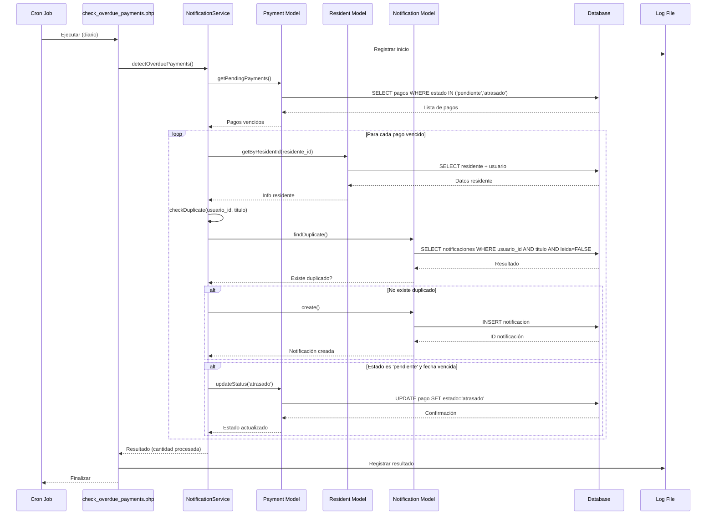

# Documento de Diseño Técnico

## Overview

El módulo de notificaciones de pagos vencidos es una extensión del sistema de gestión de condominio existente que automatiza la detección de pagos atrasados y la generación de notificaciones persistentes. El diseño se integra con la arquitectura MVC existente en PHP, utilizando los modelos Payment y Resident actuales, y aprovechando la tabla `notificaciones` ya presente en la base de datos.

### Objetivos del Diseño

- Detectar automáticamente pagos con estado "pendiente" o "atrasado" cuya fecha de pago ha vencido
- Generar notificaciones persistentes en la base de datos sin duplicados
- Actualizar el estado de pagos pendientes a atrasados cuando corresponda
- Proporcionar interfaces de visualización para residentes y administradores
- Permitir ejecución programada mediante cron jobs o tareas programadas

### Alcance

El diseño cubre:
- Modelo Notification para gestionar notificaciones
- NotificationController para interfaces de usuario
- Servicio NotificationService para lógica de negocio
- Script ejecutable para detección automática (cron job)
- Vistas para residentes y administradores

El diseño NO cubre:
- Envío de notificaciones por email o SMS (fase futura)
- Configuración de cron jobs en el servidor (responsabilidad de infraestructura)
- Modificación de la estructura de la tabla notificaciones existente

## Architecture

### Arquitectura General

El módulo sigue el patrón MVC existente del sistema con una capa adicional de servicios para encapsular la lógica de negocio compleja:

```
┌─────────────────────────────────────────────────────────────┐
│                      Capa de Presentación                    │
│  ┌──────────────────┐         ┌──────────────────┐         │
│  │ Vistas Residente │         │ Vistas Admin     │         │
│  │ - Lista notif.   │         │ - Lista global   │         │
│  │ - Contador       │         │ - Filtros        │         │
│  └──────────────────┘         └──────────────────┘         │
└─────────────────────────────────────────────────────────────┘
                            │
                            ▼
┌─────────────────────────────────────────────────────────────┐
│                    Capa de Controladores                     │
│              ┌──────────────────────────────┐               │
│              │  NotificationController      │               │
│              │  - index()                   │               │
│              │  - markAsRead()              │               │
│              │  - getUnreadCount()          │               │
│              └──────────────────────────────┘               │
└─────────────────────────────────────────────────────────────┘
                            │
                            ▼
┌─────────────────────────────────────────────────────────────┐
│                     Capa de Servicios                        │
│              ┌──────────────────────────────┐               │
│              │  NotificationService         │               │
│              │  - detectOverduePayments()   │               │
│              │  - generateNotifications()   │               │
│              │  - updatePaymentStatus()     │               │
│              │  - checkDuplicate()          │               │
│              └──────────────────────────────┘               │
└─────────────────────────────────────────────────────────────┘
                            │
                            ▼
┌─────────────────────────────────────────────────────────────┐
│                      Capa de Modelos                         │
│  ┌──────────────┐  ┌──────────────┐  ┌──────────────┐     │
│  │ Notification │  │ Payment      │  │ Resident     │     │
│  │ (nuevo)      │  │ (existente)  │  │ (existente)  │     │
│  └──────────────┘  └──────────────┘  └──────────────┘     │
└─────────────────────────────────────────────────────────────┘
                            │
                            ▼
┌─────────────────────────────────────────────────────────────┐
│                    Base de Datos MySQL                       │
│         notificaciones  │  pagos  │  residentes             │
└─────────────────────────────────────────────────────────────┘

┌─────────────────────────────────────────────────────────────┐
│                    Ejecución Programada                      │
│              ┌──────────────────────────────┐               │
│              │  check_overdue_payments.php  │               │
│              │  (Script ejecutable)         │               │
│              │  - Invoca NotificationService│               │
│              │  - Registra logs             │               │
│              └──────────────────────────────┘               │
└─────────────────────────────────────────────────────────────┘
```

### Flujo de Detección y Notificación



### Decisiones de Diseño

1. **Capa de Servicios**: Se introduce NotificationService para encapsular la lógica de negocio compleja (detección, validación de duplicados, actualización de estados). Esto mantiene los controladores delgados y facilita la reutilización desde el script de cron.

2. **Script Independiente**: El script check_overdue_payments.php es ejecutable desde línea de comandos, permitiendo su invocación por cron sin depender de la interfaz web.

3. **Prevención de Duplicados**: La verificación de duplicados se basa en usuario_id, título de notificación y estado de lectura. Esto permite regenerar notificaciones si el residente las marca como leídas pero el pago sigue pendiente.

4. **Actualización de Estado**: Los pagos pendientes se actualizan a "atrasado" automáticamente cuando se detecta el vencimiento, manteniendo la consistencia de datos.

5. **Logging**: Se utiliza el sistema de logs existente para registrar cada ejecución del detector, facilitando auditoría y troubleshooting.

## Components and Interfaces

### Notification Model

Modelo para gestionar notificaciones en la tabla `notificaciones`.

```php
class Notification {
    private $conn;
    private $table_name = "notificaciones";
    
    public $id;
    public $usuario_id;
    public $titulo;
    public $mensaje;
    public $tipo;
    public $leida;
    public $created_at;
    
    public function __construct($db);
    
    // Crear notificación
    public function create(): bool;
    
    // Leer notificaciones por usuario
    public function readByUser($usuario_id): PDOStatement;
    
    // Leer notificaciones no leídas por usuario
    public function readUnreadByUser($usuario_id): PDOStatement;
    
    // Contar notificaciones no leídas
    public function countUnreadByUser($usuario_id): int;
    
    // Marcar como leída
    public function markAsRead(): bool;
    
    // Buscar notificación duplicada
    public function findDuplicate($usuario_id, $titulo, $leida = false): ?array;
    
    // Leer todas las notificaciones (admin)
    public function readAll($filters = []): PDOStatement;
    
    // Obtener estadísticas
    public function getStats(): array;
}
```

### NotificationService

Servicio que encapsula la lógica de negocio para detección y generación de notificaciones.

```php
class NotificationService {
    private $db;
    private $payment;
    private $resident;
    private $notification;
    
    public function __construct($db);
    
    // Detectar pagos vencidos y generar notificaciones
    public function processOverduePayments(): array;
    
    // Detectar pagos vencidos
    private function detectOverduePayments(): array;
    
    // Generar notificación para un pago vencido
    private function generateNotification($payment_data, $resident_data): bool;
    
    // Verificar si existe notificación duplicada
    private function checkDuplicate($usuario_id, $titulo): bool;
    
    // Actualizar estado de pago a atrasado
    private function updatePaymentToOverdue($payment_id): bool;
    
    // Construir título de notificación
    private function buildNotificationTitle($concepto): string;
    
    // Construir mensaje de notificación
    private function buildNotificationMessage($payment_data): string;
}
```

### NotificationController

Controlador para gestionar las interfaces de usuario de notificaciones.

```php
class NotificationController extends Controller {
    private $notification;
    private $resident;
    
    public function __construct();
    
    // Listar notificaciones del usuario actual
    public function index(): void;
    
    // Marcar notificación como leída
    public function markAsRead($id): void;
    
    // Obtener contador de notificaciones no leídas (AJAX)
    public function getUnreadCount(): void;
    
    // Vista de administración (solo admin)
    public function admin(): void;
    
    // Obtener estadísticas (solo admin)
    public function stats(): void;
}
```

### Script Ejecutable

Script para ejecución programada mediante cron.

```php
// check_overdue_payments.php
// Ejecutable desde línea de comandos
// Uso: php check_overdue_payments.php

// Inicializar conexión a base de datos
// Instanciar NotificationService
// Ejecutar processOverduePayments()
// Registrar resultado en logs
// Retornar código de salida
```

## Data Models

### Notification Model - Estructura de Datos

La tabla `notificaciones` ya existe en la base de datos con la siguiente estructura:

```sql
CREATE TABLE notificaciones (
    id INT AUTO_INCREMENT PRIMARY KEY,
    usuario_id INT NOT NULL,
    titulo VARCHAR(100) NOT NULL,
    mensaje TEXT NOT NULL,
    tipo ENUM('info', 'warning', 'success', 'error') DEFAULT 'info',
    leida BOOLEAN DEFAULT FALSE,
    created_at TIMESTAMP DEFAULT CURRENT_TIMESTAMP,
    FOREIGN KEY (usuario_id) REFERENCES usuarios(id) ON DELETE CASCADE
);
```

### Relaciones entre Modelos

```
usuarios (1) ──────< (N) notificaciones
usuarios (1) ──────< (1) residentes
residentes (1) ─────< (N) pagos

Flujo de datos:
pagos.residente_id → residentes.id → residentes.usuario_id → usuarios.id
notificaciones.usuario_id → usuarios.id
```

### Formato de Notificaciones

Para pagos vencidos, las notificaciones seguirán este formato:

```
titulo: "Pago Vencido - [concepto]"
mensaje: "Estimado residente, le recordamos que tiene un pago pendiente:
          Concepto: [concepto]
          Monto: $[monto]
          Mes: [mes_pago]
          Fecha de vencimiento: [fecha_pago]
          Por favor, regularice su situación a la brevedad."
tipo: "warning"
leida: FALSE
```

### Ejemplo de Datos

```php
[
    'id' => 1,
    'usuario_id' => 5,
    'titulo' => 'Pago Vencido - Cuota de Mantenimiento',
    'mensaje' => 'Estimado residente, le recordamos que tiene un pago pendiente:
                  Concepto: Cuota de Mantenimiento
                  Monto: $1500.00
                  Mes: 2024-01
                  Fecha de vencimiento: 2024-01-10
                  Por favor, regularice su situación a la brevedad.',
    'tipo' => 'warning',
    'leida' => false,
    'created_at' => '2024-01-15 08:00:00'
]
```


## Error Handling

### Estrategia General

El módulo implementa manejo de errores en múltiples capas para garantizar robustez y facilitar debugging:

1. **Capa de Base de Datos**: Uso de try-catch para capturar PDOException
2. **Capa de Servicio**: Validación de datos y manejo de casos edge
3. **Capa de Controlador**: Mensajes flash para feedback al usuario
4. **Script de Cron**: Logging de errores sin interrumpir procesamiento

### Escenarios de Error y Manejo

#### 1. Error de Conexión a Base de Datos

```php
// En NotificationService::processOverduePayments()
try {
    $overdue_payments = $this->detectOverduePayments();
} catch (PDOException $e) {
    error_log("Error al detectar pagos vencidos: " . $e->getMessage());
    return [
        'success' => false,
        'error' => 'Error de conexión a base de datos',
        'processed' => 0
    ];
}
```

**Acción**: Registrar error en logs, retornar resultado con success=false, no interrumpir ejecución del script.

#### 2. Residente No Encontrado

```php
// En NotificationService::generateNotification()
$resident_data = $this->resident->readOne();
if (!$resident_data) {
    error_log("Residente no encontrado para pago ID: " . $payment_data['id']);
    return false; // Continuar con siguiente pago
}
```

**Acción**: Registrar warning en logs, omitir generación de notificación para ese pago, continuar con siguientes pagos.

#### 3. Fallo al Crear Notificación

```php
// En NotificationService::generateNotification()
if (!$this->notification->create()) {
    error_log("Error al crear notificación para usuario ID: " . $resident_data['usuario_id']);
    return false;
}
```

**Acción**: Registrar error en logs, retornar false, el pago se procesará en la siguiente ejecución.

#### 4. Fallo al Actualizar Estado de Pago

```php
// En NotificationService::updatePaymentToOverdue()
try {
    if (!$this->payment->update()) {
        error_log("Error al actualizar estado de pago ID: " . $payment_id);
        return false;
    }
} catch (PDOException $e) {
    error_log("Excepción al actualizar pago: " . $e->getMessage());
    return false;
}
```

**Acción**: Registrar error, retornar false, la notificación se crea de todos modos (prioridad en avisar al residente).

#### 5. Permisos Insuficientes (Controlador)

```php
// En NotificationController::admin()
$this->requireAdmin();
// Si no es admin, requireAdmin() redirige automáticamente con mensaje flash
```

**Acción**: Redirección automática con mensaje flash de error, sin acceso a funcionalidad.

#### 6. Notificación No Encontrada

```php
// En NotificationController::markAsRead()
$this->notification->id = $id;
$notification_data = $this->notification->readOne();
if (!$notification_data) {
    flash('Notificación no encontrada', 'error');
    redirect('/notifications');
    return;
}
```

**Acción**: Mensaje flash al usuario, redirección a lista de notificaciones.

#### 7. Acceso No Autorizado a Notificación

```php
// En NotificationController::markAsRead()
if ($notification_data['usuario_id'] != $current_user['id'] && !isAdmin()) {
    flash('No tiene permisos para acceder a esta notificación', 'error');
    redirect('/notifications');
    return;
}
```

**Acción**: Mensaje flash de error, redirección, prevención de acceso no autorizado.

### Logging

El sistema utiliza el sistema de logs de PHP para registrar eventos importantes:

```php
// Formato de logs
// [TIMESTAMP] [NIVEL] [COMPONENTE] Mensaje

// Ejemplos:
error_log("[NotificationService] Inicio de detección de pagos vencidos");
error_log("[NotificationService] Procesados: 5 pagos, Notificaciones creadas: 3");
error_log("[NotificationService] ERROR: Fallo al crear notificación para usuario 10");
```

### Validación de Datos

```php
// En NotificationService::generateNotification()
// Validar que los datos requeridos existen
if (empty($payment_data['concepto']) || empty($payment_data['monto'])) {
    error_log("Datos de pago incompletos para ID: " . $payment_data['id']);
    return false;
}

if (empty($resident_data['usuario_id'])) {
    error_log("Usuario ID no encontrado para residente ID: " . $payment_data['residente_id']);
    return false;
}
```

### Transacciones

Para operaciones críticas que involucran múltiples tablas:

```php
// En NotificationService::processOverduePayments()
// No se usan transacciones porque:
// 1. Cada pago se procesa independientemente
// 2. Un fallo en un pago no debe revertir los anteriores
// 3. La idempotencia se garantiza mediante verificación de duplicados
```

## Testing Strategy

### Enfoque General

Este módulo NO utiliza Property-Based Testing porque:
- Es principalmente CRUD con operaciones de base de datos
- Involucra efectos secundarios (INSERT, UPDATE en MySQL)
- No contiene funciones puras con transformaciones de datos complejas
- No hay parsers, serializadores o algoritmos que se beneficien de PBT

La estrategia de testing se basa en:
1. **Unit Tests con Mocks**: Para lógica de negocio aislada
2. **Integration Tests**: Para verificar interacción con base de datos
3. **End-to-End Tests**: Para flujos completos de usuario

### Unit Tests

#### NotificationService Tests

```php
// tests/NotificationServiceTest.php

class NotificationServiceTest extends PHPUnit\Framework\TestCase {
    
    // Test: Detectar pagos vencidos con estado pendiente
    public function testDetectOverduePaymentsWithPendingStatus() {
        // Arrange: Mock Payment model con pagos pendientes vencidos
        // Act: Llamar detectOverduePayments()
        // Assert: Verificar que retorna lista de pagos con fecha < hoy
    }
    
    // Test: Detectar pagos con estado atrasado
    public function testDetectOverduePaymentsWithOverdueStatus() {
        // Arrange: Mock Payment model con pagos atrasados
        // Act: Llamar detectOverduePayments()
        // Assert: Verificar que retorna todos los pagos atrasados
    }
    
    // Test: No generar notificación duplicada
    public function testDoNotGenerateDuplicateNotification() {
        // Arrange: Mock Notification model que retorna notificación existente
        // Act: Llamar generateNotification()
        // Assert: Verificar que no se crea nueva notificación
    }
    
    // Test: Generar notificación cuando no existe duplicado
    public function testGenerateNotificationWhenNoDuplicate() {
        // Arrange: Mock Notification model que retorna null (no duplicado)
        // Act: Llamar generateNotification()
        // Assert: Verificar que se crea notificación con datos correctos
    }
    
    // Test: Actualizar estado de pago pendiente a atrasado
    public function testUpdatePendingPaymentToOverdue() {
        // Arrange: Mock Payment model con pago pendiente vencido
        // Act: Llamar updatePaymentToOverdue()
        // Assert: Verificar que estado se actualiza a 'atrasado'
    }
    
    // Test: Construir título de notificación correctamente
    public function testBuildNotificationTitle() {
        // Arrange: Concepto de pago
        // Act: Llamar buildNotificationTitle()
        // Assert: Verificar formato "Pago Vencido - [concepto]"
    }
    
    // Test: Construir mensaje de notificación con todos los datos
    public function testBuildNotificationMessage() {
        // Arrange: Datos de pago completos
        // Act: Llamar buildNotificationMessage()
        // Assert: Verificar que mensaje contiene concepto, monto, mes, fecha
    }
    
    // Test: Manejar error cuando residente no existe
    public function testHandleMissingResident() {
        // Arrange: Mock Resident model que retorna null
        // Act: Llamar generateNotification()
        // Assert: Verificar que retorna false y registra error
    }
    
    // Test: Procesar múltiples pagos vencidos
    public function testProcessMultipleOverduePayments() {
        // Arrange: Mock con 3 pagos vencidos
        // Act: Llamar processOverduePayments()
        // Assert: Verificar que procesa los 3 y retorna estadísticas
    }
}
```

#### Notification Model Tests

```php
// tests/NotificationModelTest.php

class NotificationModelTest extends PHPUnit\Framework\TestCase {
    
    // Test: Crear notificación exitosamente
    public function testCreateNotification() {
        // Arrange: Datos válidos de notificación
        // Act: Llamar create()
        // Assert: Verificar que retorna true y se asigna ID
    }
    
    // Test: Leer notificaciones por usuario
    public function testReadByUser() {
        // Arrange: Usuario con notificaciones
        // Act: Llamar readByUser()
        // Assert: Verificar que retorna solo notificaciones del usuario
    }
    
    // Test: Contar notificaciones no leídas
    public function testCountUnreadByUser() {
        // Arrange: Usuario con 3 notificaciones no leídas
        // Act: Llamar countUnreadByUser()
        // Assert: Verificar que retorna 3
    }
    
    // Test: Marcar notificación como leída
    public function testMarkAsRead() {
        // Arrange: Notificación no leída
        // Act: Llamar markAsRead()
        // Assert: Verificar que leida = true
    }
    
    // Test: Encontrar notificación duplicada
    public function testFindDuplicate() {
        // Arrange: Notificación existente no leída con mismo título
        // Act: Llamar findDuplicate()
        // Assert: Verificar que retorna la notificación existente
    }
    
    // Test: No encontrar duplicado cuando está leída
    public function testNoDuplicateWhenRead() {
        // Arrange: Notificación existente pero leída
        // Act: Llamar findDuplicate()
        // Assert: Verificar que retorna null
    }
}
```

#### NotificationController Tests

```php
// tests/NotificationControllerTest.php

class NotificationControllerTest extends PHPUnit\Framework\TestCase {
    
    // Test: Residente ve solo sus notificaciones
    public function testResidentSeesOnlyOwnNotifications() {
        // Arrange: Usuario residente autenticado
        // Act: Llamar index()
        // Assert: Verificar que solo se muestran sus notificaciones
    }
    
    // Test: Admin ve todas las notificaciones
    public function testAdminSeesAllNotifications() {
        // Arrange: Usuario admin autenticado
        // Act: Llamar admin()
        // Assert: Verificar que se muestran todas las notificaciones
    }
    
    // Test: Marcar notificación como leída
    public function testMarkNotificationAsRead() {
        // Arrange: Notificación no leída del usuario
        // Act: Llamar markAsRead()
        // Assert: Verificar que se actualiza y redirige
    }
    
    // Test: No permitir marcar notificación de otro usuario
    public function testCannotMarkOtherUserNotification() {
        // Arrange: Notificación de otro usuario
        // Act: Llamar markAsRead()
        // Assert: Verificar que redirige con error
    }
    
    // Test: Obtener contador de no leídas (AJAX)
    public function testGetUnreadCount() {
        // Arrange: Usuario con 5 notificaciones no leídas
        // Act: Llamar getUnreadCount()
        // Assert: Verificar que retorna JSON con count=5
    }
}
```

### Integration Tests

```php
// tests/integration/NotificationIntegrationTest.php

class NotificationIntegrationTest extends PHPUnit\Framework\TestCase {
    
    // Test: Flujo completo de detección y notificación
    public function testCompleteOverduePaymentFlow() {
        // Arrange: Base de datos de prueba con pago vencido
        // Act: Ejecutar NotificationService::processOverduePayments()
        // Assert: Verificar que se crea notificación en BD y se actualiza estado
    }
    
    // Test: No crear notificación duplicada en BD
    public function testNoDuplicateNotificationInDatabase() {
        // Arrange: Notificación existente en BD
        // Act: Ejecutar processOverduePayments() dos veces
        // Assert: Verificar que solo existe una notificación
    }
    
    // Test: Actualizar estado de múltiples pagos
    public function testUpdateMultiplePaymentStatuses() {
        // Arrange: 3 pagos pendientes vencidos en BD
        // Act: Ejecutar processOverduePayments()
        // Assert: Verificar que los 3 cambian a 'atrasado'
    }
}
```

### End-to-End Tests

```php
// tests/e2e/NotificationE2ETest.php

class NotificationE2ETest extends PHPUnit\Framework\TestCase {
    
    // Test: Residente ve notificación en su panel
    public function testResidentSeesNotificationInDashboard() {
        // Arrange: Login como residente con notificación
        // Act: Navegar a dashboard
        // Assert: Verificar que se muestra notificación y contador
    }
    
    // Test: Residente marca notificación como leída
    public function testResidentMarksNotificationAsRead() {
        // Arrange: Login como residente con notificación no leída
        // Act: Click en notificación
        // Assert: Verificar que desaparece de no leídas y contador actualiza
    }
    
    // Test: Admin filtra notificaciones por residente
    public function testAdminFiltersNotificationsByResident() {
        // Arrange: Login como admin
        // Act: Seleccionar filtro de residente
        // Assert: Verificar que solo se muestran notificaciones de ese residente
    }
}
```

### Test de Script de Cron

```php
// tests/CronScriptTest.php

class CronScriptTest extends PHPUnit\Framework\TestCase {
    
    // Test: Script ejecuta sin errores
    public function testScriptExecutesSuccessfully() {
        // Arrange: Base de datos de prueba
        // Act: Ejecutar check_overdue_payments.php
        // Assert: Verificar código de salida 0
    }
    
    // Test: Script registra logs correctamente
    public function testScriptLogsExecution() {
        // Arrange: Archivo de log limpio
        // Act: Ejecutar script
        // Assert: Verificar que se registra inicio, resultado y fin
    }
    
    // Test: Script maneja errores de BD sin fallar
    public function testScriptHandlesDatabaseError() {
        // Arrange: BD no disponible
        // Act: Ejecutar script
        // Assert: Verificar que registra error y retorna código != 0
    }
}
```

### Cobertura de Testing

Objetivos de cobertura:
- **NotificationService**: 90%+ (lógica crítica de negocio)
- **Notification Model**: 85%+ (operaciones CRUD)
- **NotificationController**: 80%+ (flujos de usuario)
- **Script de Cron**: 75%+ (ejecución y logging)

### Herramientas

- **PHPUnit**: Framework de testing principal
- **Mockery**: Para crear mocks de modelos y base de datos
- **PHPUnit Database Extension**: Para tests de integración con BD
- **PHP Code Coverage**: Para medir cobertura de código

### Ejecución de Tests

```bash
# Ejecutar todos los tests
vendor/bin/phpunit

# Ejecutar solo unit tests
vendor/bin/phpunit tests/

# Ejecutar solo integration tests
vendor/bin/phpunit tests/integration/

# Ejecutar con cobertura
vendor/bin/phpunit --coverage-html coverage/
```

### Datos de Prueba

Se utilizarán fixtures para datos de prueba consistentes:

```php
// tests/fixtures/payments.php
return [
    'overdue_pending' => [
        'id' => 1,
        'residente_id' => 1,
        'monto' => 1500.00,
        'concepto' => 'Cuota de Mantenimiento',
        'mes_pago' => '2024-01',
        'fecha_pago' => '2024-01-10',
        'estado' => 'pendiente'
    ],
    'overdue_late' => [
        'id' => 2,
        'residente_id' => 2,
        'monto' => 1500.00,
        'concepto' => 'Cuota de Mantenimiento',
        'mes_pago' => '2023-12',
        'fecha_pago' => '2023-12-10',
        'estado' => 'atrasado'
    ]
];
```

