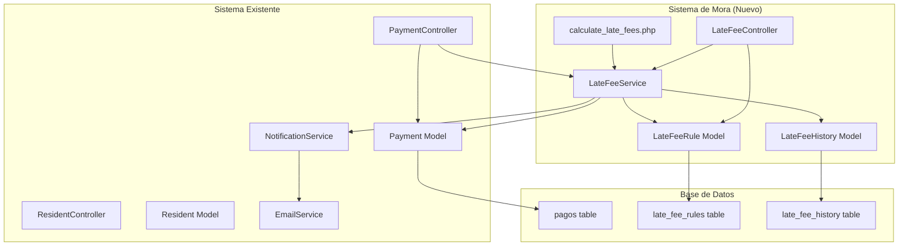

# Design Document: Sistema de Reglas de Mora (Late Fee System)

## Overview

El Sistema de Reglas de Mora es un subsistema que se integra con la aplicación ResiTech existente para automatizar el cálculo y gestión de recargos por pagos atrasados. El sistema permite a los administradores configurar reglas flexibles de mora, calcula automáticamente los recargos basándose en días de atraso, y proporciona transparencia completa a los residentes sobre los montos adeudados.

### Key Features

- Configuración flexible de reglas de mora (porcentaje o monto fijo)
- Cálculo automático diario de recargos
- Múltiples frecuencias de aplicación (única, diaria, semanal, mensual)
- Topes máximos configurables
- Historial completo de auditoría
- Integración con sistema de notificaciones existente
- Reportes detallados de mora
- Ajustes manuales con justificación

### Design Goals

1. **Compatibilidad**: Integración sin romper funcionalidad existente
2. **Flexibilidad**: Soporte para múltiples tipos de reglas y escenarios
3. **Transparencia**: Desglose claro de montos para residentes
4. **Auditoría**: Trazabilidad completa de todos los cálculos y ajustes
5. **Automatización**: Cálculo diario sin intervención manual

## Architecture

### System Context



### Component Architecture

El sistema se compone de los siguientes componentes principales:

1. **LateFeeRule Model**: Gestiona las reglas de configuración de mora
2. **LateFeeService**: Lógica de negocio para cálculo de mora
3. **LateFeeHistory Model**: Registro de auditoría de cálculos y ajustes
4. **LateFeeController**: Interfaz administrativa para gestión de reglas
5. **Payment Model (Extended)**: Campos adicionales para mora
6. **calculate_late_fees.php**: Script cron para cálculo automático

### Integration Points

- **Payment Model**: Extensión con campos de mora
- **PaymentController**: Integración de vistas con desglose de mora
- **NotificationService**: Notificaciones de aplicación de mora
- **EmailService**: Emails informativos sobre recargos
- **ReportController**: Reportes con información de mora

## Components and Interfaces

### 1. LateFeeRule Model

**Responsabilidad**: Gestionar las reglas de configuración de mora en la base de datos.

**Propiedades Públicas**:
```php
class LateFeeRule {
    public $id;
    public $nombre;                  // Nombre descriptivo de la regla
    public $dias_gracia;             // Días de gracia antes de aplicar mora
    public $tipo_recargo;            // 'porcentaje' o 'monto_fijo'
    public $valor_recargo;           // Valor del recargo (% o monto)
    public $frecuencia;              // 'unica', 'diaria', 'semanal', 'mensual'
    public $tope_maximo;             // Límite máximo de mora (nullable)
    public $tipo_pago;               // Tipo de pago aplicable (nullable = global)
    public $activa;                  // Estado activo/inactivo
    public $created_at;
    public $updated_at;
}
```

**Métodos Principales**:
```php
// CRUD Operations
public function create(): bool
public function readAll(): PDOStatement
public function readOne(): array|false
public function update(): bool
public function delete(): bool

// Business Logic
public function getActiveRules(): PDOStatement
public function getRuleForPaymentType(string $tipo_pago): array|false
public function canDelete(): bool  // Verifica si tiene mora aplicada
public function activate(): bool
public function deactivate(): bool
```

### 2. LateFeeService

**Responsabilidad**: Encapsular toda la lógica de negocio para cálculo de mora.

**Métodos Principales**:
```php
class LateFeeService {
    private $db;
    private $payment;
    private $lateFeeRule;
    private $lateFeeHistory;
    private $notificationService;
    
    public function __construct($db)
    
    // Cálculo automático
    public function processOverduePayments(): array
    public function calculateLateFee(array $payment_data): float
    
    // Aplicación de mora
    public function applyLateFee(int $payment_id, float $amount, int $rule_id): bool
    public function removeLateFee(int $payment_id): bool
    
    // Ajustes manuales
    public function adjustLateFee(int $payment_id, float $new_amount, int $user_id, string $justification): bool
    
    // Consultas
    public function getLateFeeBreakdown(int $payment_id): array
    public function getLateFeeStats(): array
    public function getMonthlyLateFeeIncome(int $months = 12): array
    
    // Helpers privados
    private function getDaysOverdue(string $due_date, int $grace_days): int
    private function calculateByPercentage(float $original_amount, float $percentage, int $frequency_multiplier): float
    private function calculateByFixedAmount(float $fixed_amount, int $frequency_multiplier): float
    private function getFrequencyMultiplier(string $frequency, int $days_overdue): int
    private function applyMaxCap(float $calculated_amount, ?float $max_cap): float
    private function findApplicableRule(array $payment_data): array|false
    private function logCalculation(int $payment_id, int $rule_id, float $calculated, float $applied, int $days_overdue): bool
    private function sendLateFeeNotification(array $payment_data, array $resident_data, float $late_fee_amount): void
}
```

**Algoritmo de Cálculo**:
```php
/**
 * Algoritmo de cálculo de mora
 * 
 * 1. Obtener días de atraso = (fecha_actual - fecha_vencimiento) - dias_gracia
 * 2. Si días_atraso <= 0, retornar 0
 * 3. Buscar regla aplicable (específica por tipo_pago o global)
 * 4. Si no hay regla activa, retornar 0
 * 5. Calcular multiplicador de frecuencia:
 *    - única: 1
 *    - diaria: dias_atraso
 *    - semanal: floor(dias_atraso / 7)
 *    - mensual: floor(dias_atraso / 30)
 * 6. Calcular monto base:
 *    - porcentaje: (monto_original * porcentaje / 100) * multiplicador
 *    - monto_fijo: valor_fijo * multiplicador
 * 7. Aplicar tope máximo si existe
 * 8. Retornar monto calculado
 */
```

### 3. LateFeeHistory Model

**Responsabilidad**: Mantener registro de auditoría de todos los cálculos y ajustes.

**Propiedades Públicas**:
```php
class LateFeeHistory {
    public $id;
    public $pago_id;
    public $regla_mora_id;
    public $monto_calculado;         // Monto calculado por el algoritmo
    public $monto_aplicado;          // Monto realmente aplicado
    public $dias_atraso;
    public $tipo_operacion;          // 'calculo_automatico', 'ajuste_manual', 'eliminacion'
    public $usuario_id;              // Usuario que realizó la operación (nullable)
    public $justificacion;           // Justificación para ajustes manuales
    public $created_at;
}
```

**Métodos Principales**:
```php
public function create(): bool
public function getByPaymentId(int $payment_id): PDOStatement
public function getRecentHistory(int $limit = 100): PDOStatement
```

### 4. LateFeeController

**Responsabilidad**: Gestionar las interfaces administrativas para reglas de mora.

**Rutas y Acciones**:
```php
// Gestión de reglas
GET  /admin/late-fee-rules          -> index()      // Listar reglas
GET  /admin/late-fee-rules/create   -> create()     // Formulario crear
POST /admin/late-fee-rules          -> store()      // Guardar nueva regla
GET  /admin/late-fee-rules/:id/edit -> edit($id)    // Formulario editar
POST /admin/late-fee-rules/:id      -> update($id)  // Actualizar regla
POST /admin/late-fee-rules/:id/delete -> delete($id) // Eliminar regla
POST /admin/late-fee-rules/:id/toggle -> toggle($id) // Activar/desactivar

// Simulación y ajustes
GET  /admin/late-fee-rules/simulate -> simulate()   // Simulador de cálculo
POST /admin/payments/:id/adjust-late-fee -> adjustLateFee($id) // Ajuste manual

// Reportes
GET  /admin/late-fees/report        -> report()     // Reporte de mora
GET  /admin/late-fees/stats         -> stats()      // Estadísticas
```

### 5. Payment Model (Extended)

**Campos Adicionales**:
```php
public $monto_original;              // Monto sin mora
public $monto_mora;                  // Monto de mora aplicado
public $fecha_aplicacion_mora;       // Fecha de aplicación de mora
public $regla_mora_id;               // ID de regla aplicada (nullable)
```

**Métodos Adicionales**:
```php
public function getMonto_total(): float {
    return $this->monto_original + $this->monto_mora;
}

public function hasLateFee(): bool {
    return $this->monto_mora > 0;
}

public function getLateFeePercentage(): float {
    if ($this->monto_original == 0) return 0;
    return ($this->monto_mora / $this->monto_original) * 100;
}
```

## Data Models

### Database Schema

#### Tabla: late_fee_rules

```sql
CREATE TABLE late_fee_rules (
    id INT AUTO_INCREMENT PRIMARY KEY,
    nombre VARCHAR(100) NOT NULL,
    dias_gracia INT NOT NULL DEFAULT 0,
    tipo_recargo ENUM('porcentaje', 'monto_fijo') NOT NULL,
    valor_recargo DECIMAL(10,2) NOT NULL,
    frecuencia ENUM('unica', 'diaria', 'semanal', 'mensual') NOT NULL DEFAULT 'unica',
    tope_maximo DECIMAL(10,2) NULL,
    tipo_pago VARCHAR(50) NULL COMMENT 'NULL = aplica a todos los tipos',
    activa BOOLEAN DEFAULT TRUE,
    created_at TIMESTAMP DEFAULT CURRENT_TIMESTAMP,
    updated_at TIMESTAMP DEFAULT CURRENT_TIMESTAMP ON UPDATE CURRENT_TIMESTAMP,
    INDEX idx_activa (activa),
    INDEX idx_tipo_pago (tipo_pago)
) ENGINE=InnoDB DEFAULT CHARSET=utf8mb4;
```

#### Tabla: pagos (modificada)

```sql
ALTER TABLE pagos 
ADD COLUMN monto_original DECIMAL(10,2) NULL AFTER monto,
ADD COLUMN monto_mora DECIMAL(10,2) DEFAULT 0.00 AFTER monto_original,
ADD COLUMN fecha_aplicacion_mora DATE NULL AFTER monto_mora,
ADD COLUMN regla_mora_id INT NULL AFTER fecha_aplicacion_mora,
ADD FOREIGN KEY (regla_mora_id) REFERENCES late_fee_rules(id) ON DELETE SET NULL,
ADD INDEX idx_estado_fecha (estado, fecha_pago),
ADD INDEX idx_regla_mora (regla_mora_id);
```

#### Tabla: late_fee_history

```sql
CREATE TABLE late_fee_history (
    id INT AUTO_INCREMENT PRIMARY KEY,
    pago_id INT NOT NULL,
    regla_mora_id INT NULL,
    monto_calculado DECIMAL(10,2) NOT NULL,
    monto_aplicado DECIMAL(10,2) NOT NULL,
    dias_atraso INT NOT NULL,
    tipo_operacion ENUM('calculo_automatico', 'ajuste_manual', 'eliminacion') NOT NULL,
    usuario_id INT NULL COMMENT 'Usuario que realizó ajuste manual',
    justificacion TEXT NULL,
    created_at TIMESTAMP DEFAULT CURRENT_TIMESTAMP,
    FOREIGN KEY (pago_id) REFERENCES pagos(id) ON DELETE CASCADE,
    FOREIGN KEY (regla_mora_id) REFERENCES late_fee_rules(id) ON DELETE SET NULL,
    FOREIGN KEY (usuario_id) REFERENCES usuarios(id) ON DELETE SET NULL,
    INDEX idx_pago_id (pago_id),
    INDEX idx_tipo_operacion (tipo_operacion),
    INDEX idx_created_at (created_at)
) ENGINE=InnoDB DEFAULT CHARSET=utf8mb4;
```

### Migration Script

```sql
-- Migration: add_late_fee_system.sql
-- Descripción: Agrega tablas y campos para el sistema de reglas de mora

START TRANSACTION;

-- 1. Crear tabla de reglas de mora
CREATE TABLE IF NOT EXISTS late_fee_rules (
    id INT AUTO_INCREMENT PRIMARY KEY,
    nombre VARCHAR(100) NOT NULL,
    dias_gracia INT NOT NULL DEFAULT 0,
    tipo_recargo ENUM('porcentaje', 'monto_fijo') NOT NULL,
    valor_recargo DECIMAL(10,2) NOT NULL,
    frecuencia ENUM('unica', 'diaria', 'semanal', 'mensual') NOT NULL DEFAULT 'unica',
    tope_maximo DECIMAL(10,2) NULL,
    tipo_pago VARCHAR(50) NULL,
    activa BOOLEAN DEFAULT TRUE,
    created_at TIMESTAMP DEFAULT CURRENT_TIMESTAMP,
    updated_at TIMESTAMP DEFAULT CURRENT_TIMESTAMP ON UPDATE CURRENT_TIMESTAMP,
    INDEX idx_activa (activa),
    INDEX idx_tipo_pago (tipo_pago)
) ENGINE=InnoDB DEFAULT CHARSET=utf8mb4;

-- 2. Modificar tabla pagos para agregar campos de mora
-- Primero verificar si las columnas ya existen
SET @dbname = DATABASE();
SET @tablename = 'pagos';
SET @columnname = 'monto_original';
SET @preparedStatement = (SELECT IF(
  (
    SELECT COUNT(*) FROM INFORMATION_SCHEMA.COLUMNS
    WHERE
      (table_name = @tablename)
      AND (table_schema = @dbname)
      AND (column_name = @columnname)
  ) > 0,
  'SELECT 1',
  'ALTER TABLE pagos ADD COLUMN monto_original DECIMAL(10,2) NULL AFTER monto'
));
PREPARE alterIfNotExists FROM @preparedStatement;
EXECUTE alterIfNotExists;
DEALLOCATE PREPARE alterIfNotExists;

-- Agregar monto_mora
SET @columnname = 'monto_mora';
SET @preparedStatement = (SELECT IF(
  (
    SELECT COUNT(*) FROM INFORMATION_SCHEMA.COLUMNS
    WHERE
      (table_name = @tablename)
      AND (table_schema = @dbname)
      AND (column_name = @columnname)
  ) > 0,
  'SELECT 1',
  'ALTER TABLE pagos ADD COLUMN monto_mora DECIMAL(10,2) DEFAULT 0.00 AFTER monto_original'
));
PREPARE alterIfNotExists FROM @preparedStatement;
EXECUTE alterIfNotExists;
DEALLOCATE PREPARE alterIfNotExists;

-- Agregar fecha_aplicacion_mora
SET @columnname = 'fecha_aplicacion_mora';
SET @preparedStatement = (SELECT IF(
  (
    SELECT COUNT(*) FROM INFORMATION_SCHEMA.COLUMNS
    WHERE
      (table_name = @tablename)
      AND (table_schema = @dbname)
      AND (column_name = @columnname)
  ) > 0,
  'SELECT 1',
  'ALTER TABLE pagos ADD COLUMN fecha_aplicacion_mora DATE NULL AFTER monto_mora'
));
PREPARE alterIfNotExists FROM @preparedStatement;
EXECUTE alterIfNotExists;
DEALLOCATE PREPARE alterIfNotExists;

-- Agregar regla_mora_id
SET @columnname = 'regla_mora_id';
SET @preparedStatement = (SELECT IF(
  (
    SELECT COUNT(*) FROM INFORMATION_SCHEMA.COLUMNS
    WHERE
      (table_name = @tablename)
      AND (table_schema = @dbname)
      AND (column_name = @columnname)
  ) > 0,
  'SELECT 1',
  'ALTER TABLE pagos ADD COLUMN regla_mora_id INT NULL AFTER fecha_aplicacion_mora'
));
PREPARE alterIfNotExists FROM @preparedStatement;
EXECUTE alterIfNotExists;
DEALLOCATE PREPARE alterIfNotExists;

-- 3. Migrar datos existentes: monto actual -> monto_original
UPDATE pagos 
SET monto_original = monto, 
    monto_mora = 0.00 
WHERE monto_original IS NULL;

-- 4. Agregar foreign key para regla_mora_id (si no existe)
SET @fk_name = 'fk_pagos_regla_mora';
SET @preparedStatement = (SELECT IF(
  (
    SELECT COUNT(*) FROM INFORMATION_SCHEMA.KEY_COLUMN_USAGE
    WHERE
      (table_name = @tablename)
      AND (table_schema = @dbname)
      AND (constraint_name = @fk_name)
  ) > 0,
  'SELECT 1',
  'ALTER TABLE pagos ADD CONSTRAINT fk_pagos_regla_mora FOREIGN KEY (regla_mora_id) REFERENCES late_fee_rules(id) ON DELETE SET NULL'
));
PREPARE alterIfNotExists FROM @preparedStatement;
EXECUTE alterIfNotExists;
DEALLOCATE PREPARE alterIfNotExists;

-- 5. Agregar índices
CREATE INDEX IF NOT EXISTS idx_estado_fecha ON pagos(estado, fecha_pago);
CREATE INDEX IF NOT EXISTS idx_regla_mora ON pagos(regla_mora_id);

-- 6. Crear tabla de historial de mora
CREATE TABLE IF NOT EXISTS late_fee_history (
    id INT AUTO_INCREMENT PRIMARY KEY,
    pago_id INT NOT NULL,
    regla_mora_id INT NULL,
    monto_calculado DECIMAL(10,2) NOT NULL,
    monto_aplicado DECIMAL(10,2) NOT NULL,
    dias_atraso INT NOT NULL,
    tipo_operacion ENUM('calculo_automatico', 'ajuste_manual', 'eliminacion') NOT NULL,
    usuario_id INT NULL,
    justificacion TEXT NULL,
    created_at TIMESTAMP DEFAULT CURRENT_TIMESTAMP,
    FOREIGN KEY (pago_id) REFERENCES pagos(id) ON DELETE CASCADE,
    FOREIGN KEY (regla_mora_id) REFERENCES late_fee_rules(id) ON DELETE SET NULL,
    FOREIGN KEY (usuario_id) REFERENCES usuarios(id) ON DELETE SET NULL,
    INDEX idx_pago_id (pago_id),
    INDEX idx_tipo_operacion (tipo_operacion),
    INDEX idx_created_at (created_at)
) ENGINE=InnoDB DEFAULT CHARSET=utf8mb4;

-- 7. Insertar regla de mora por defecto (ejemplo)
INSERT INTO late_fee_rules (nombre, dias_gracia, tipo_recargo, valor_recargo, frecuencia, tope_maximo, tipo_pago, activa)
VALUES ('Mora Estándar - 2% Mensual', 5, 'porcentaje', 2.00, 'mensual', NULL, NULL, TRUE)
ON DUPLICATE KEY UPDATE nombre = nombre;

COMMIT;
```

## Error Handling

### Validation Rules

**LateFeeRule Validation**:
```php
$rules = [
    'nombre' => ['required' => true, 'max' => 100],
    'dias_gracia' => ['required' => true, 'numeric' => true, 'min' => 0],
    'tipo_recargo' => ['required' => true, 'in' => ['porcentaje', 'monto_fijo']],
    'valor_recargo' => ['required' => true, 'numeric' => true, 'min' => 0.01],
    'frecuencia' => ['required' => true, 'in' => ['unica', 'diaria', 'semanal', 'mensual']],
    'tope_maximo' => ['numeric' => true, 'min' => 0],
    'tipo_pago' => ['max' => 50]
];

// Validación adicional según tipo
if ($tipo_recargo === 'porcentaje') {
    // Validar que el porcentaje esté entre 0.01 y 100
    if ($valor_recargo < 0.01 || $valor_recargo > 100) {
        $errors['valor_recargo'] = 'El porcentaje debe estar entre 0.01 y 100';
    }
}
```

### Error Scenarios

1. **Regla no encontrada**: Retornar error 404 con mensaje claro
2. **Regla inactiva**: No aplicar mora, registrar en log
3. **Pago ya pagado**: No recalcular mora, mantener valor congelado
4. **División por cero**: Validar monto_original > 0 antes de calcular porcentaje
5. **Regla con mora aplicada**: Prevenir eliminación, mostrar mensaje informativo
6. **Ajuste manual sin justificación**: Rechazar con error de validación
7. **Cálculo automático fallido**: Registrar en log, continuar con siguiente pago

### Logging Strategy

```php
// Logs de cálculo automático
error_log("[LateFeeService] Procesando pago ID: {$payment_id}, Días atraso: {$days_overdue}");
error_log("[LateFeeService] Regla aplicada: {$rule_name}, Monto calculado: {$calculated_amount}");

// Logs de ajustes manuales
error_log("[LateFeeService] Ajuste manual - Pago ID: {$payment_id}, Usuario: {$user_id}, Monto anterior: {$old_amount}, Monto nuevo: {$new_amount}");

// Logs de errores
error_log("[LateFeeService] ERROR: No se pudo aplicar mora a pago ID: {$payment_id} - {$error_message}");
```

## Testing Strategy

### Unit Tests

El sistema utilizará PHPUnit para pruebas unitarias. Dado que PHP no tiene una biblioteca estándar de property-based testing ampliamente adoptada, nos enfocaremos en pruebas unitarias exhaustivas con casos de borde.

**Áreas de prueba**:

1. **LateFeeService - Cálculo de mora**:
   - Cálculo por porcentaje con diferentes valores
   - Cálculo por monto fijo con diferentes frecuencias
   - Aplicación de topes máximos
   - Cálculo de días de atraso con período de gracia
   - Multiplicadores de frecuencia (diaria, semanal, mensual)

2. **LateFeeRule Model - Validación**:
   - Validación de rangos de porcentaje (0.01-100)
   - Validación de montos positivos
   - Validación de días de gracia no negativos
   - Prevención de eliminación con mora aplicada

3. **Payment Model - Integración**:
   - Cálculo de monto total (original + mora)
   - Detección de pagos con mora
   - Cálculo de porcentaje de mora

4. **LateFeeHistory - Auditoría**:
   - Registro de cálculos automáticos
   - Registro de ajustes manuales
   - Preservación de historial

**Ejemplo de pruebas unitarias**:

```php
class LateFeeServiceTest extends PHPUnit\Framework\TestCase {
    
    public function testCalculatePercentageLateFee() {
        // Arrange
        $service = new LateFeeService($this->db);
        $payment = [
            'monto_original' => 1000.00,
            'fecha_pago' => '2024-01-01',
            'estado' => 'atrasado'
        ];
        $rule = [
            'dias_gracia' => 5,
            'tipo_recargo' => 'porcentaje',
            'valor_recargo' => 2.00,
            'frecuencia' => 'unica',
            'tope_maximo' => null
        ];
        
        // Act
        $late_fee = $service->calculateLateFee($payment, $rule, 10); // 10 días atraso
        
        // Assert
        $this->assertEquals(20.00, $late_fee); // 1000 * 2% = 20
    }
    
    public function testCalculateMonthlyLateFee() {
        // Arrange
        $service = new LateFeeService($this->db);
        $payment = ['monto_original' => 1000.00];
        $rule = [
            'dias_gracia' => 0,
            'tipo_recargo' => 'monto_fijo',
            'valor_recargo' => 50.00,
            'frecuencia' => 'mensual',
            'tope_maximo' => null
        ];
        
        // Act
        $late_fee = $service->calculateLateFee($payment, $rule, 65); // 65 días = 2 meses
        
        // Assert
        $this->assertEquals(100.00, $late_fee); // 50 * 2 = 100
    }
    
    public function testApplyMaxCap() {
        // Arrange
        $service = new LateFeeService($this->db);
        $payment = ['monto_original' => 1000.00];
        $rule = [
            'dias_gracia' => 0,
            'tipo_recargo' => 'porcentaje',
            'valor_recargo' => 10.00,
            'frecuencia' => 'mensual',
            'tope_maximo' => 150.00
        ];
        
        // Act
        $late_fee = $service->calculateLateFee($payment, $rule, 90); // 90 días = 3 meses
        
        // Assert
        // Sin tope sería: 1000 * 10% * 3 = 300
        // Con tope de 150: 150
        $this->assertEquals(150.00, $late_fee);
    }
    
    public function testGracePeriodPreventsLateFee() {
        // Arrange
        $service = new LateFeeService($this->db);
        $payment = ['monto_original' => 1000.00];
        $rule = [
            'dias_gracia' => 10,
            'tipo_recargo' => 'porcentaje',
            'valor_recargo' => 2.00,
            'frecuencia' => 'unica',
            'tope_maximo' => null
        ];
        
        // Act
        $late_fee = $service->calculateLateFee($payment, $rule, 5); // 5 días < 10 gracia
        
        // Assert
        $this->assertEquals(0.00, $late_fee);
    }
    
    public function testWeeklyFrequencyMultiplier() {
        // Arrange
        $service = new LateFeeService($this->db);
        $payment = ['monto_original' => 1000.00];
        $rule = [
            'dias_gracia' => 0,
            'tipo_recargo' => 'monto_fijo',
            'valor_recargo' => 25.00,
            'frecuencia' => 'semanal',
            'tope_maximo' => null
        ];
        
        // Act
        $late_fee = $service->calculateLateFee($payment, $rule, 20); // 20 días = 2 semanas
        
        // Assert
        $this->assertEquals(50.00, $late_fee); // 25 * 2 = 50
    }
}
```

### Integration Tests

**Escenarios de integración**:

1. **Flujo completo de cálculo automático**:
   - Script cron ejecuta processOverduePayments()
   - Se detectan pagos atrasados
   - Se aplica mora según reglas
   - Se registra en historial
   - Se envían notificaciones

2. **Ajuste manual de mora**:
   - Administrador ajusta mora de un pago
   - Se registra en historial con justificación
   - Se actualiza monto total
   - Se notifica al residente

3. **Integración con reportes**:
   - Generar reporte de ingresos incluyendo mora
   - Exportar a Excel/PDF con desglose
   - Estadísticas de mora en dashboard

4. **Casos especiales**:
   - Pago parcial recalcula mora sobre saldo
   - Cambio de estado detiene cálculo automático
   - Desactivación de regla preserva mora aplicada

### Manual Testing Checklist

- [ ] Crear regla de mora con porcentaje
- [ ] Crear regla de mora con monto fijo
- [ ] Activar/desactivar reglas
- [ ] Simular cálculo de mora
- [ ] Ejecutar cálculo automático (cron)
- [ ] Verificar notificaciones enviadas
- [ ] Ajustar mora manualmente
- [ ] Ver historial de mora de un pago
- [ ] Generar reporte de mora
- [ ] Exportar reporte a Excel
- [ ] Ver desglose de mora como residente
- [ ] Verificar tope máximo aplicado
- [ ] Probar período de gracia
- [ ] Intentar eliminar regla con mora aplicada
- [ ] Verificar integridad de datos después de migración


## Implementation Details

### View Structure

#### Admin Views

**1. app/views/admin/late_fee_rules/index.php**
- Lista de todas las reglas de mora
- Indicadores visuales de estado (activa/inactiva)
- Botones de acción: crear, editar, activar/desactivar, eliminar
- Tabla con columnas: nombre, tipo, valor, frecuencia, tope, estado, acciones

**2. app/views/admin/late_fee_rules/create.php**
- Formulario de creación de regla
- Campos: nombre, días de gracia, tipo de recargo, valor, frecuencia, tope máximo, tipo de pago
- Validación en tiempo real con JavaScript
- Vista previa de cálculo

**3. app/views/admin/late_fee_rules/edit.php**
- Formulario de edición (similar a create)
- Muestra información de pagos con mora aplicada
- Advertencia si hay mora aplicada

**4. app/views/admin/late_fee_rules/simulate.php**
- Simulador de cálculo de mora
- Inputs: monto, días de atraso, selección de regla
- Muestra cálculo paso a paso

**5. app/views/admin/payments/edit.php (modificado)**
- Sección adicional para ajuste de mora
- Campo de monto de mora editable
- Campo de justificación obligatorio
- Muestra historial de mora

**6. app/views/admin/late_fees/report.php**
- Reporte de ingresos por mora
- Filtros: rango de fechas, estado
- Gráficos de mora mensual
- Tabla detallada con exportación

**7. app/views/admin/late_fees/stats.php**
- Dashboard de estadísticas de mora
- Total recaudado, pendiente, promedio
- Gráficos de tendencias
- Top residentes con mora

#### Resident Views

**1. app/views/payments/index.php (modificado)**
- Indicador visual de pagos con mora (badge rojo)
- Columna adicional: "Mora"
- Total de mora pendiente destacado

**2. app/views/payments/show.php (modificado)**
- Sección de desglose de mora:
  - Monto original
  - Monto de mora
  - Monto total
  - Días de atraso
  - Regla aplicada
  - Fecha de aplicación
  - Explicación del cálculo
- Historial de ajustes (si existen)

### Scheduled Task

**calculate_late_fees.php**

```php
<?php
/**
 * Script de Cálculo Automático de Mora
 * 
 * Ejecuta el cálculo diario de recargos por mora para pagos atrasados.
 * Debe ejecutarse mediante cron job diariamente.
 * 
 * Uso: php calculate_late_fees.php
 * 
 * Configuración de cron recomendada:
 * 0 2 * * * php /ruta/al/proyecto/calculate_late_fees.php
 * (Ejecutar diariamente a las 2:00 AM)
 */

define('ROOT_PATH', dirname(__FILE__));
define('APP_PATH', ROOT_PATH . '/app');
define('CONFIG_PATH', ROOT_PATH . '/config');

// Cargar autoloader
require_once ROOT_PATH . '/vendor/autoload.php';

// Cargar variables de entorno
try {
    $dotenv = Dotenv\Dotenv::createImmutable(ROOT_PATH);
    $dotenv->load();
} catch (Exception $e) {
    error_log("[calculate_late_fees.php] .env file error: " . $e->getMessage());
}

// Registrar inicio
error_log("[calculate_late_fees.php] ========================================");
error_log("[calculate_late_fees.php] Inicio: " . date('Y-m-d H:i:s'));

try {
    // Cargar configuración
    require_once CONFIG_PATH . '/database.php';
    
    // Cargar clases
    require_once APP_PATH . '/models/Database.php';
    require_once APP_PATH . '/models/Payment.php';
    require_once APP_PATH . '/models/Resident.php';
    require_once APP_PATH . '/models/Notification.php';
    require_once APP_PATH . '/models/LateFeeRule.php';
    require_once APP_PATH . '/models/LateFeeHistory.php';
    require_once APP_PATH . '/services/EmailService.php';
    require_once APP_PATH . '/services/NotificationService.php';
    require_once APP_PATH . '/services/LateFeeService.php';
    
    // Conectar a base de datos
    $database = new Database();
    $db = $database->getConnection();
    
    if (!$db) {
        throw new Exception("No se pudo conectar a la base de datos");
    }
    
    error_log("[calculate_late_fees.php] Conexión establecida");
    
    // Instanciar servicio
    $lateFeeService = new LateFeeService($db);
    
    // Ejecutar cálculo
    error_log("[calculate_late_fees.php] Iniciando cálculo de mora...");
    $result = $lateFeeService->processOverduePayments();
    
    // Registrar resultado
    if ($result['success']) {
        error_log("[calculate_late_fees.php] Completado exitosamente");
        error_log("[calculate_late_fees.php] Pagos procesados: " . $result['processed']);
        error_log("[calculate_late_fees.php] Mora aplicada: " . $result['late_fees_applied']);
        error_log("[calculate_late_fees.php] Notificaciones enviadas: " . $result['notifications_sent']);
        
        if (isset($result['errors']) && $result['errors'] > 0) {
            error_log("[calculate_late_fees.php] Errores: " . $result['errors']);
        }
        
        error_log("[calculate_late_fees.php] Fin: " . date('Y-m-d H:i:s'));
        error_log("[calculate_late_fees.php] ========================================");
        exit(0);
    } else {
        error_log("[calculate_late_fees.php] ERROR: " . ($result['error'] ?? 'Desconocido'));
        error_log("[calculate_late_fees.php] Fin: " . date('Y-m-d H:i:s'));
        error_log("[calculate_late_fees.php] ========================================");
        exit(1);
    }
    
} catch (Exception $e) {
    error_log("[calculate_late_fees.php] EXCEPCIÓN: " . $e->getMessage());
    error_log("[calculate_late_fees.php] Stack trace: " . $e->getTraceAsString());
    error_log("[calculate_late_fees.php] Fin: " . date('Y-m-d H:i:s'));
    error_log("[calculate_late_fees.php] ========================================");
    exit(1);
}
?>
```

### Routing Configuration

**config/routes.php (additions)**

```php
// Late Fee Rules Management (Admin only)
$router->get('/admin/late-fee-rules', 'LateFeeController@index');
$router->get('/admin/late-fee-rules/create', 'LateFeeController@create');
$router->post('/admin/late-fee-rules', 'LateFeeController@store');
$router->get('/admin/late-fee-rules/{id}/edit', 'LateFeeController@edit');
$router->post('/admin/late-fee-rules/{id}', 'LateFeeController@update');
$router->post('/admin/late-fee-rules/{id}/delete', 'LateFeeController@delete');
$router->post('/admin/late-fee-rules/{id}/toggle', 'LateFeeController@toggle');

// Late Fee Simulation and Adjustment
$router->get('/admin/late-fee-rules/simulate', 'LateFeeController@simulate');
$router->post('/admin/payments/{id}/adjust-late-fee', 'LateFeeController@adjustLateFee');

// Late Fee Reports
$router->get('/admin/late-fees/report', 'LateFeeController@report');
$router->get('/admin/late-fees/stats', 'LateFeeController@stats');
```

### Code Examples

#### LateFeeService::calculateLateFee() Implementation

```php
/**
 * Calcular mora para un pago
 * 
 * @param array $payment_data Datos del pago
 * @return float Monto de mora calculado
 */
public function calculateLateFee(array $payment_data): float {
    try {
        // 1. Obtener regla aplicable
        $rule = $this->findApplicableRule($payment_data);
        
        if (!$rule || !$rule['activa']) {
            error_log("[LateFeeService] No hay regla activa para pago ID: " . $payment_data['id']);
            return 0.00;
        }
        
        // 2. Calcular días de atraso
        $days_overdue = $this->getDaysOverdue($payment_data['fecha_pago'], $rule['dias_gracia']);
        
        if ($days_overdue <= 0) {
            return 0.00;
        }
        
        // 3. Obtener multiplicador de frecuencia
        $frequency_multiplier = $this->getFrequencyMultiplier($rule['frecuencia'], $days_overdue);
        
        // 4. Calcular monto base según tipo
        if ($rule['tipo_recargo'] === 'porcentaje') {
            $base_amount = $this->calculateByPercentage(
                $payment_data['monto_original'],
                $rule['valor_recargo'],
                $frequency_multiplier
            );
        } else {
            $base_amount = $this->calculateByFixedAmount(
                $rule['valor_recargo'],
                $frequency_multiplier
            );
        }
        
        // 5. Aplicar tope máximo si existe
        $final_amount = $this->applyMaxCap($base_amount, $rule['tope_maximo']);
        
        error_log("[LateFeeService] Pago ID: {$payment_data['id']}, Días atraso: {$days_overdue}, Mora calculada: {$final_amount}");
        
        return round($final_amount, 2);
        
    } catch (Exception $e) {
        error_log("[LateFeeService] Error calculando mora: " . $e->getMessage());
        return 0.00;
    }
}

/**
 * Calcular días de atraso considerando período de gracia
 */
private function getDaysOverdue(string $due_date, int $grace_days): int {
    $due = new DateTime($due_date);
    $today = new DateTime();
    $interval = $today->diff($due);
    $days = $interval->days;
    
    // Restar días de gracia
    $days_overdue = $days - $grace_days;
    
    return max(0, $days_overdue);
}

/**
 * Calcular multiplicador según frecuencia
 */
private function getFrequencyMultiplier(string $frequency, int $days_overdue): int {
    switch ($frequency) {
        case 'unica':
            return 1;
        case 'diaria':
            return $days_overdue;
        case 'semanal':
            return floor($days_overdue / 7);
        case 'mensual':
            return floor($days_overdue / 30);
        default:
            return 1;
    }
}

/**
 * Calcular mora por porcentaje
 */
private function calculateByPercentage(float $original_amount, float $percentage, int $multiplier): float {
    return ($original_amount * $percentage / 100) * $multiplier;
}

/**
 * Calcular mora por monto fijo
 */
private function calculateByFixedAmount(float $fixed_amount, int $multiplier): float {
    return $fixed_amount * $multiplier;
}

/**
 * Aplicar tope máximo
 */
private function applyMaxCap(float $calculated_amount, ?float $max_cap): float {
    if ($max_cap === null || $max_cap <= 0) {
        return $calculated_amount;
    }
    
    return min($calculated_amount, $max_cap);
}

/**
 * Buscar regla aplicable para un pago
 */
private function findApplicableRule(array $payment_data): array|false {
    // Primero buscar regla específica por tipo de pago
    $this->lateFeeRule->tipo_pago = $payment_data['concepto'];
    $specific_rule = $this->lateFeeRule->getRuleForPaymentType($payment_data['concepto']);
    
    if ($specific_rule && $specific_rule['activa']) {
        return $specific_rule;
    }
    
    // Si no hay específica, buscar regla global (tipo_pago = NULL)
    $global_rule = $this->lateFeeRule->getGlobalRule();
    
    if ($global_rule && $global_rule['activa']) {
        return $global_rule;
    }
    
    return false;
}
```

#### LateFeeService::processOverduePayments() Implementation

```php
/**
 * Procesar pagos atrasados y aplicar mora
 * 
 * @return array Resultado del procesamiento
 */
public function processOverduePayments(): array {
    try {
        error_log("[LateFeeService] Inicio de procesamiento de mora");
        
        // Obtener pagos atrasados sin mora o con mora desactualizada
        $overdue_payments = $this->getOverduePayments();
        
        $processed = 0;
        $late_fees_applied = 0;
        $notifications_sent = 0;
        $errors = 0;
        
        foreach ($overdue_payments as $payment_data) {
            try {
                $processed++;
                
                // Calcular mora
                $late_fee_amount = $this->calculateLateFee($payment_data);
                
                if ($late_fee_amount <= 0) {
                    continue;
                }
                
                // Obtener regla aplicada
                $rule = $this->findApplicableRule($payment_data);
                
                if (!$rule) {
                    continue;
                }
                
                // Aplicar mora
                if ($this->applyLateFee($payment_data['id'], $late_fee_amount, $rule['id'])) {
                    $late_fees_applied++;
                    
                    // Registrar en historial
                    $days_overdue = $this->getDaysOverdue($payment_data['fecha_pago'], $rule['dias_gracia']);
                    $this->logCalculation(
                        $payment_data['id'],
                        $rule['id'],
                        $late_fee_amount,
                        $late_fee_amount,
                        $days_overdue
                    );
                    
                    // Enviar notificación (solo la primera vez)
                    if ($payment_data['monto_mora'] == 0 || $payment_data['monto_mora'] === null) {
                        $this->resident->id = $payment_data['residente_id'];
                        $resident_data = $this->resident->readOne();
                        
                        if ($resident_data) {
                            $this->sendLateFeeNotification($payment_data, $resident_data, $late_fee_amount);
                            $notifications_sent++;
                        }
                    }
                }
                
            } catch (Exception $e) {
                error_log("[LateFeeService] Error procesando pago ID {$payment_data['id']}: " . $e->getMessage());
                $errors++;
            }
        }
        
        error_log("[LateFeeService] Procesamiento completado: {$processed} pagos, {$late_fees_applied} moras aplicadas, {$notifications_sent} notificaciones");
        
        return [
            'success' => true,
            'processed' => $processed,
            'late_fees_applied' => $late_fees_applied,
            'notifications_sent' => $notifications_sent,
            'errors' => $errors
        ];
        
    } catch (Exception $e) {
        error_log("[LateFeeService] Error general: " . $e->getMessage());
        return [
            'success' => false,
            'error' => $e->getMessage(),
            'processed' => 0
        ];
    }
}

/**
 * Obtener pagos atrasados que requieren cálculo de mora
 */
private function getOverduePayments(): array {
    $query = "SELECT p.*, r.apartamento, u.nombre, u.email 
              FROM pagos p
              LEFT JOIN residentes r ON p.residente_id = r.id
              LEFT JOIN usuarios u ON r.usuario_id = u.id
              WHERE p.estado IN ('pendiente', 'atrasado')
              AND p.fecha_pago < CURDATE()
              AND (p.monto_mora IS NULL OR p.monto_mora = 0 OR p.fecha_aplicacion_mora < CURDATE())
              ORDER BY p.fecha_pago ASC";
    
    $stmt = $this->db->prepare($query);
    $stmt->execute();
    
    return $stmt->fetchAll(PDO::FETCH_ASSOC);
}

/**
 * Aplicar mora a un pago
 */
public function applyLateFee(int $payment_id, float $amount, int $rule_id): bool {
    try {
        $query = "UPDATE pagos 
                  SET monto_mora = :monto_mora,
                      fecha_aplicacion_mora = CURDATE(),
                      regla_mora_id = :regla_mora_id
                  WHERE id = :id";
        
        $stmt = $this->db->prepare($query);
        $stmt->bindParam(':monto_mora', $amount);
        $stmt->bindParam(':regla_mora_id', $rule_id);
        $stmt->bindParam(':id', $payment_id);
        
        return $stmt->execute();
        
    } catch (PDOException $e) {
        error_log("[LateFeeService] Error aplicando mora: " . $e->getMessage());
        return false;
    }
}

/**
 * Registrar cálculo en historial
 */
private function logCalculation(int $payment_id, int $rule_id, float $calculated, float $applied, int $days_overdue): bool {
    $this->lateFeeHistory->pago_id = $payment_id;
    $this->lateFeeHistory->regla_mora_id = $rule_id;
    $this->lateFeeHistory->monto_calculado = $calculated;
    $this->lateFeeHistory->monto_aplicado = $applied;
    $this->lateFeeHistory->dias_atraso = $days_overdue;
    $this->lateFeeHistory->tipo_operacion = 'calculo_automatico';
    $this->lateFeeHistory->usuario_id = null;
    $this->lateFeeHistory->justificacion = null;
    
    return $this->lateFeeHistory->create();
}

/**
 * Enviar notificación de mora aplicada
 */
private function sendLateFeeNotification(array $payment_data, array $resident_data, float $late_fee_amount): void {
    try {
        // Crear notificación en sistema
        $titulo = "Recargo por Mora Aplicado - " . $payment_data['concepto'];
        $mensaje = "Estimado residente,\n\n";
        $mensaje .= "Se ha aplicado un recargo por mora a su pago:\n\n";
        $mensaje .= "Concepto: " . $payment_data['concepto'] . "\n";
        $mensaje .= "Monto original: $" . number_format($payment_data['monto_original'], 2) . "\n";
        $mensaje .= "Recargo por mora: $" . number_format($late_fee_amount, 2) . "\n";
        $mensaje .= "Monto total: $" . number_format($payment_data['monto_original'] + $late_fee_amount, 2) . "\n";
        $mensaje .= "Fecha de vencimiento: " . $payment_data['fecha_pago'] . "\n\n";
        $mensaje .= "Por favor, regularice su situación a la brevedad.";
        
        $this->notification->usuario_id = $resident_data['usuario_id'];
        $this->notification->titulo = $titulo;
        $this->notification->mensaje = $mensaje;
        $this->notification->tipo = 'warning';
        $this->notification->leida = false;
        
        $this->notification->create();
        
        // Enviar email
        $this->notificationService->sendPaymentEmail($payment_data, $resident_data, 'late_fee_applied');
        
    } catch (Exception $e) {
        error_log("[LateFeeService] Error enviando notificación: " . $e->getMessage());
    }
}
```

#### LateFeeController::adjustLateFee() Implementation

```php
/**
 * Ajustar manualmente la mora de un pago
 */
public function adjustLateFee($id) {
    $this->requireAdmin();
    
    if ($_SERVER['REQUEST_METHOD'] !== 'POST') {
        flash('Método no permitido', 'error');
        redirect('/payments/' . $id);
        return;
    }
    
    $data = $this->getPostData();
    
    // Validar
    $errors = $this->validate($data, [
        'monto_mora' => ['required' => true, 'numeric' => true, 'min' => 0],
        'justificacion' => ['required' => true, 'min' => 10, 'max' => 500]
    ]);
    
    if (!empty($errors)) {
        flash('Error en la validación: ' . implode(', ', $errors), 'error');
        redirect('/payments/' . $id . '/edit');
        return;
    }
    
    // Obtener pago actual
    $this->payment->id = $id;
    $payment_data = $this->payment->readOne();
    
    if (!$payment_data) {
        flash('Pago no encontrado', 'error');
        redirect('/payments');
        return;
    }
    
    // Obtener usuario actual
    $current_user = $this->getCurrentUser();
    
    // Aplicar ajuste
    $lateFeeService = new LateFeeService($this->db);
    $result = $lateFeeService->adjustLateFee(
        $id,
        $data['monto_mora'],
        $current_user['id'],
        $data['justificacion']
    );
    
    if ($result) {
        flash('Mora ajustada correctamente', 'success');
    } else {
        flash('Error al ajustar la mora', 'error');
    }
    
    redirect('/payments/' . $id);
}
```

### Email Template

**app/views/emails/late_fee_notification.php**

```php
<?php
// Load base template
$base_path = __DIR__ . '/base.php';
ob_start();
?>

<tr>
    <td style="padding: 20px; background-color: #ffffff;">
        <h2 style="color: #d32f2f; margin-top: 0;">Recargo por Mora Aplicado</h2>
        
        <p>Estimado/a <?php echo htmlspecialchars($resident_name); ?>,</p>
        
        <p>Le informamos que se ha aplicado un recargo por mora a su pago debido a que ha excedido la fecha de vencimiento.</p>
        
        <table style="width: 100%; border-collapse: collapse; margin: 20px 0;">
            <tr style="background-color: #f5f5f5;">
                <td style="padding: 10px; border: 1px solid #ddd;"><strong>Concepto:</strong></td>
                <td style="padding: 10px; border: 1px solid #ddd;"><?php echo htmlspecialchars($payment_concept); ?></td>
            </tr>
            <tr>
                <td style="padding: 10px; border: 1px solid #ddd;"><strong>Monto Original:</strong></td>
                <td style="padding: 10px; border: 1px solid #ddd;">$<?php echo $payment_amount; ?></td>
            </tr>
            <tr style="background-color: #ffebee;">
                <td style="padding: 10px; border: 1px solid #ddd;"><strong>Recargo por Mora:</strong></td>
                <td style="padding: 10px; border: 1px solid #ddd; color: #d32f2f;">$<?php echo $late_fee_amount; ?></td>
            </tr>
            <tr style="background-color: #f5f5f5;">
                <td style="padding: 10px; border: 1px solid #ddd;"><strong>Monto Total:</strong></td>
                <td style="padding: 10px; border: 1px solid #ddd; font-weight: bold;">$<?php echo $total_amount; ?></td>
            </tr>
            <tr>
                <td style="padding: 10px; border: 1px solid #ddd;"><strong>Fecha de Vencimiento:</strong></td>
                <td style="padding: 10px; border: 1px solid #ddd;"><?php echo $due_date; ?></td>
            </tr>
            <tr>
                <td style="padding: 10px; border: 1px solid #ddd;"><strong>Días de Atraso:</strong></td>
                <td style="padding: 10px; border: 1px solid #ddd;"><?php echo $days_overdue; ?></td>
            </tr>
        </table>
        
        <div style="background-color: #fff3cd; border-left: 4px solid #ffc107; padding: 15px; margin: 20px 0;">
            <p style="margin: 0;"><strong>Importante:</strong> Le solicitamos regularizar su situación a la brevedad para evitar recargos adicionales.</p>
        </div>
        
        <p>Si tiene alguna consulta sobre este recargo, por favor contacte a la administración.</p>
        
        <p>Atentamente,<br>
        <strong>Administración del Condominio</strong></p>
    </td>
</tr>

<?php
$content = ob_get_clean();
include $base_path;
?>
```

## Deployment Considerations

### Installation Steps

1. **Backup de base de datos**:
   ```bash
   mysqldump -u usuario -p condominio_db > backup_pre_mora.sql
   ```

2. **Ejecutar migración**:
   ```bash
   mysql -u usuario -p condominio_db < database/add_late_fee_system.sql
   ```

3. **Verificar migración**:
   ```sql
   SHOW TABLES LIKE 'late_fee%';
   DESCRIBE pagos;
   SELECT COUNT(*) FROM pagos WHERE monto_original IS NOT NULL;
   ```

4. **Configurar cron job**:
   ```bash
   crontab -e
   # Agregar línea:
   0 2 * * * php /ruta/completa/al/proyecto/calculate_late_fees.php >> /ruta/logs/late_fees_cron.log 2>&1
   ```

5. **Crear regla de mora inicial**:
   - Acceder a /admin/late-fee-rules/create
   - Configurar regla según políticas del condominio
   - Activar regla

6. **Prueba manual**:
   ```bash
   php calculate_late_fees.php
   ```

7. **Verificar logs**:
   ```bash
   tail -f logs/late_fees_cron.log
   ```

### Rollback Plan

Si es necesario revertir los cambios:

```sql
-- Rollback script
START TRANSACTION;

-- Eliminar foreign key
ALTER TABLE pagos DROP FOREIGN KEY fk_pagos_regla_mora;

-- Eliminar columnas agregadas
ALTER TABLE pagos 
DROP COLUMN regla_mora_id,
DROP COLUMN fecha_aplicacion_mora,
DROP COLUMN monto_mora,
DROP COLUMN monto_original;

-- Eliminar tablas nuevas
DROP TABLE IF EXISTS late_fee_history;
DROP TABLE IF EXISTS late_fee_rules;

COMMIT;
```

### Performance Considerations

1. **Índices**: Las tablas incluyen índices en campos frecuentemente consultados
2. **Batch Processing**: El script cron procesa pagos en lotes para evitar timeouts
3. **Caching**: Considerar cachear reglas activas en memoria durante procesamiento
4. **Query Optimization**: Usar EXPLAIN para optimizar consultas complejas

### Security Considerations

1. **Validación de entrada**: Todos los inputs son validados y sanitizados
2. **Autorización**: Solo administradores pueden gestionar reglas y ajustar mora
3. **Auditoría**: Todos los cambios se registran en late_fee_history
4. **SQL Injection**: Uso de prepared statements en todas las consultas
5. **XSS Prevention**: Escape de output en todas las vistas

### Monitoring and Alerts

1. **Logs de cron**: Revisar diariamente logs de ejecución
2. **Alertas de error**: Configurar notificaciones si el script falla
3. **Métricas**: Monitorear total de mora aplicada vs esperada
4. **Auditoría**: Revisar historial de ajustes manuales periódicamente

## Conclusion

Este diseño proporciona una solución completa y robusta para el sistema de reglas de mora, integrándose perfectamente con la arquitectura existente de ResiTech. El sistema es flexible, auditable, y proporciona transparencia completa tanto para administradores como para residentes.

Las decisiones de diseño priorizan:
- **Compatibilidad** con el código existente
- **Flexibilidad** para diferentes políticas de mora
- **Transparencia** en cálculos y aplicación
- **Auditoría** completa de todas las operaciones
- **Automatización** para reducir carga administrativa

El sistema está listo para implementación siguiendo las especificaciones de este documento.
